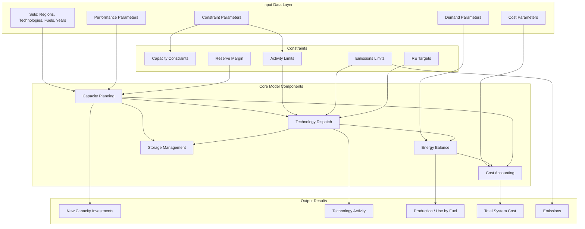

# OSeMOSYS: Open Source energy MOdeling SYStem

## Table of Contents
1. [Overview](#overview)
2. [Model Architecture](#model-architecture)
3. [Sets (Dimensions)](#sets-dimensions)
4. [Parameters (Input Data)](#parameters-input-data)
5. [Variables (Model Outputs)](#variables-model-outputs)
6. [Data Setup Guide](#data-setup-guide)
7. [Parameter Interactions](#parameter-interactions)
8. [Minimum Model Requirements](#minimum-model-requirements)
9. [Critical Assumptions and Limitations](#critical-assumptions-and-limitations)
10. [Running the Model](#running-the-model)

OSeMOSYS is a linear programming optimization model for long-term energy system planning. It minimizes the total discounted system cost while meeting energy demands and respecting technical, environmental, and policy constraints.

**Objective Function**: Minimize total discounted cost across all regions and years

## Model Architecture


## Sets (Dimensions)

Sets define the dimensions over which the model operates. All parameters and variables are indexed by combinations of these sets.

### Examples
#### YEAR
Model planning horizon. Years don't need to be consecutive but should span your planning period.
```
YEAR = {2020, 2025, 2030, 2035, 2040, 2045, 2050}
```
- **Time steps**: Usually 5-year intervals (can be annual for short-term studies)
- **Note**: First year is the base year with existing infrastructure

#### TECHNOLOGY

**Example**:
```
{
    COAL_IGCC,       # Integrated gasification combined cycle
    GAS_OCGT,        # Open cycle gas turbine (peaking)
    SOLAR_PV_ROOF,   # Rooftop solar PV
    WIND_ON,         # Onshore wind
    WIND_OFF,        # Offshore wind
    HYDRO_LARGE,     # Large hydro (dam)
    
    # Fossil Fuel Supply
    COAL_MINE_DOM,   # Domestic coal mining
    GAS_IMP_LNG,     # LNG import terminal
    OIL_IMP,         # Oil import
    
    # Storage
    H2_STOR_UNDER,   # Underground hydrogen storage
    H2_STOR_TANK,    # Hydrogen tank storage
    
    # Hydrogen
    H2_ELEC_PEM,     # PEM electrolyzer
    H2_ELEC_ALK,     # Alkaline electrolyzer
    H2_SMR,          # Steam methane reforming
    H2_SMR_CCS,      # SMR with carbon capture
    H2_FC,           # Hydrogen fuel cell
}
```

#### FUEL
Energy carriers that flow through the system. **Fuels are what technologies consume and produce.**

**Example comprehensive set**:
```
FUEL = {
    # Primary Energy
    COAL_HARD,       # Hard coal (bituminous/anthracite)
    COAL_SOFT,       # Soft coal (lignite/sub-bituminous)
    GAS_NAT,         # Natural gas
    OIL_CRUDE,       # Crude oil
    URANIUM,         # Nuclear fuel
    BIOMASS,         # Solid biomass (wood, pellets)
    
    # Secondary Energy - Electricity
    ELEC_HV,         # High voltage electricity
    ELEC_MV,         # Medium voltage electricity
    ELEC_LV,         # Low voltage electricity
    ELEC,            # Generic electricity (simplified models)
    
    # Secondary Energy - Petroleum Products
    PETROL,          # Gasoline
    DIESEL,          # Diesel fuel
    JET_FUEL,        # Aviation fuel
    LPG,             # Liquefied petroleum gas
    FUEL_OIL,        # Heavy fuel oil
    
    # Secondary Energy - Hydrogen
    H2_COMPRESSED,   # Compressed hydrogen
    H2_LIQUID,       # Liquid hydrogen
    
    # Heat
    HEAT_LOW_TEMP,   # Low temperature heat (<100°C)
    HEAT_MED_TEMP,   # Medium temperature heat (100-400°C)
    HEAT_HIGH_TEMP,  # High temperature heat (>400°C)
    HEAT_DISTRICT,   # District heating
    
    # Demand Fuels (useful energy)
    ELEC_DEMAND,     # Electricity demand (end-use)
    HEAT_RES_DEMAND, # Residential heating demand
    HEAT_COM_DEMAND, # Commercial heating demand
    HEAT_IND_DEMAND, # Industrial heat demand
    TRANSPORT_PASS,  # Passenger transport demand (pkm)
    TRANSPORT_FREIGHT, # Freight transport demand (tkm)
    
    # Renewable Resources
    WIND_RESOURCE,   # Wind resource (abstract)
    SOLAR_RESOURCE,  # Solar resource (abstract)
    HYDRO_RESOURCE   # Hydro resource (abstract)
}
```

**Key Concept - Fuel vs. Technology**:
- **Fuels** are commodities that flow through the system (energy carriers)
- **Technologies** are processes that convert one fuel to another
- Example: `GAS_CCGT` (technology) converts `GAS_NAT` (input fuel) into `ELEC` (output fuel)
- Some "fuels" represent energy services/demands (e.g., `HEAT_RES_DEMAND`)
- Technologies can have multiple input/output fuels in different modes

#### EMISSION
Pollutants and greenhouse gases tracked by the model.
```
EMISSION = {
    CO2,        # Carbon dioxide
    CH4,        # Methane
    N2O,        # Nitrous oxide
    CO2EQ,      # CO2 equivalent (for combined GHG accounting)
    NOX,        # Nitrogen oxides
    SO2,        # Sulfur dioxide
    PM10,       # Particulate matter <10μm
    PM2_5,      # Particulate matter <2.5μm
    VOC,        # Volatile organic compounds
    CO,         # Carbon monoxide
    NH3         # Ammonia
}
```

#### MODE_OF_OPERATION

**What are Modes of Operation?**

Modes allow a single technology to operate in different ways with different efficiencies, fuel mixes, or outputs. The model chooses the optimal mode(s) to operate in each timeslice.

**Common Use Cases**:

1. **Different Efficiency Levels**
   - MODE1 = High efficiency (low load)
   - MODE2 = Medium efficiency (optimal load)
   - MODE3 = Low efficiency (overload)

2. **Fuel Switching**
   - MODE1 = Natural gas only
   - MODE2 = Coal only
   - MODE3 = Mixed firing (50% gas, 50% coal)

3. **Co-generation Options**
   - MODE1 = Electricity only
   - MODE2 = Combined heat and power (CHP)

4. **Seasonal Operation**
   - MODE1 = Winter operation (higher heat output)
   - MODE2 = Summer operation (lower heat output)

5. **Product Mix**
   - MODE1 = Produces gasoline and diesel (60/40)
   - MODE2 = Produces gasoline and diesel (40/60)

**Default Setup**:
```
MODE_OF_OPERATION = {MODE1}  # Single mode - simplest setup
```

**Complex Example - Gas Combined Cycle**:
```
MODE_OF_OPERATION = {MODE1, MODE2}

# MODE1: Electricity only (55% efficiency)
InputActivityRatio[GAS_CCGT, GAS_NAT, MODE1] = 1.818  # 1/0.55
OutputActivityRatio[GAS_CCGT, ELEC, MODE1] = 1.0

# MODE2: CHP mode (80% total efficiency: 45% elec, 35% heat)
InputActivityRatio[GAS_CCGT, GAS_NAT, MODE2] = 1.25   # 1/0.80
OutputActivityRatio[GAS_CCGT, ELEC, MODE2] = 0.45/0.80 = 0.5625
OutputActivityRatio[GAS_CCGT, HEAT_DISTRICT, MODE2] = 0.35/0.80 = 0.4375
```

**How Modes Affect Model Execution**:
- The model decides **how much** to operate in each mode in each timeslice
- Different modes can have different:
  - Input/output ratios (efficiencies)
  - Variable costs
  - Emission rates
- Total activity of a technology = sum of activities across all modes
- Modes don't affect capital costs (technology is the same unit)

#### REGION
Geographic or political boundaries. Can be countries, states, or grid zones.
```
REGION = {
    # Single region (simplest)
    REGION1
    
    # OR Multiple regions (with trade)
    NORTH, SOUTH, EAST, WEST
    
    # OR Detailed country example
    UK_ENGLAND, UK_SCOTLAND, UK_WALES, UK_NI
    
    # OR Grid zones
    ZONE_1, ZONE_2, ZONE_3, ZONE_4, ZONE_5
}
```

#### TIMESLICE Structure

**Timeslices are NOT required to be uniform.** The model is completely flexible in how you define time representation.

**Hierarchy**: `TIMESLICE = SEASON × DAYTYPE × DAILYTIMEBRACKET`

Each timeslice must map to exactly one season, one daytype, and one daily time bracket.

**How Non-Uniform Timeslices Work**:

The `YearSplit[l, y]` parameter specifies the fraction of the year each timeslice represents. As long as these sum to 1.0, timeslices can be any duration.

**Example 1: Uniform Timeslices** (24 equal slices)
```
SEASON = {S1, S2, S3, S4}           # 4 seasons (3 months each)
DAYTYPE = {WD, WE}                   # Weekday, Weekend
DAILYTIMEBRACKET = {H1, H2, H3}      # Morning, Afternoon, Night

# Creates 4 × 2 × 3 = 24 timeslices
TIMESLICE = {
    S1_WD_H1, S1_WD_H2, S1_WD_H3,
    S1_WE_H1, S1_WE_H2, S1_WE_H3,
    # ... etc for S2, S3, S4
}

# Each timeslice is 1/24 of the year
YearSplit[*, 2020] = 0.04167  # for all timeslices
```

**Example 2: Non-Uniform Seasonal Focus**
```
SEASON = {WINTER, SUMMER, SHOULDER}   # Different lengths
DAYTYPE = {PEAK, OFFPEAK}
DAILYTIMEBRACKET = {DAY, NIGHT}

# WINTER = 4 months, SUMMER = 4 months, SHOULDER = 4 months
# PEAK days = 5/7 of days, OFFPEAK = 2/7
# DAY = 12 hours, NIGHT = 12 hours

YearSplit[WINTER_PEAK_DAY, 2020] = (4/12) × (5/7) × (12/24) = 0.119
YearSplit[WINTER_PEAK_NIGHT, 2020] = (4/12) × (5/7) × (12/24) = 0.119
YearSplit[WINTER_OFFPEAK_DAY, 2020] = (4/12) × (2/7) × (12/24) = 0.048
YearSplit[WINTER_OFFPEAK_NIGHT, 2020] = (4/12) × (2/7) × (12/24) = 0.048
# ... similar for SUMMER and SHOULDER
```

**Example 3: High Detail for Critical Periods**
```
SEASON = {S1, S2, S3, S4}
DAYTYPE = {PEAK, OFFPEAK}
DAILYTIMEBRACKET = {H1, H2, H3, H4, H5, H6}  # 6 daily periods

# Focus detail on summer peak (S2_PEAK) with 6 time blocks
# Less detail on off-peak periods

YearSplit[S2_PEAK_H1, 2020] = 0.015  # 1.5% of year
YearSplit[S2_PEAK_H2, 2020] = 0.020  # 2.0% of year
# ... fine granularity for peak

YearSplit[S2_OFFPEAK_H1, 2020] = 0.040  # Lumped together
YearSplit[S2_OFFPEAK_H2, 2020] = 0.040
```

**Conversion Parameters** link timeslices to hierarchy:
```
# Binary: 1 if timeslice l is in season ls, 0 otherwise
Conversionls[S1_WD_H1, S1] = 1
Conversionls[S1_WD_H1, S2] = 0

# Binary: 1 if timeslice l is daytype ld, 0 otherwise  
Conversionld[S1_WD_H1, WD] = 1
Conversionld[S1_WD_H1, WE] = 0

# Binary: 1 if timeslice l is in daily bracket lh, 0 otherwise
Conversionlh[S1_WD_H1, H1] = 1
Conversionlh[S1_WD_H1, H2] = 0
```

**Choosing Timeslice Resolution**:
- **High Resolution** (100+ slices): Better captures variability, longer solve times
- **Medium Resolution** (12-24 slices): Good balance for most studies
- **Low Resolution** (4-8 slices): Fast, good for long-term strategic planning
- **Adaptive**: High detail for critical periods, low detail elsewhere

#### STORAGE
Energy storage technologies.
```
STORAGE = {
    BATTERY_LI_ION,      # Lithium-ion battery
    BATTERY_LEAD_ACID,   # Lead acid battery
    BATTERY_FLOW,        # Vanadium redox flow battery
    PUMPED_HYDRO,        # Pumped hydroelectric storage
    CAES,                # Compressed air energy storage
    H2_UNDERGROUND,      # Underground hydrogen storage (cavern)
    H2_TANK,             # Above-ground hydrogen tanks
    HEAT_TANK,           # Thermal storage tank
    ICE_STORAGE,         # Ice storage (cooling)
}
```

#### FLEXIBLEDEMANDTYPE
This set is used to model flexible demand types.
```
FLEXIBLEDEMANDTYPE = {
    FLEX_DEMAND_1
}
```

---

## Parameters (Input Data)

### Parameter Notation Key

Throughout this documentation, parameters use square bracket notation `[indices]`. Here's what each letter means:

| Symbol | Meaning | Set |
|--------|---------|-----|
| **r** | Region | REGION |
| **rr** | Second region (for trade) | REGION |
| **t** | Technology | TECHNOLOGY |
| **l** | Timeslice | TIMESLICE |
| **f** | Fuel | FUEL |
| **e** | Emission | EMISSION |
| **m** | Mode of operation | MODE_OF_OPERATION |
| **y** | Year | YEAR |
| **yy** | Second year (for accumulation) | YEAR |
| **s** | Storage | STORAGE |
| **ls** | Season | SEASON |
| **ld** | Daytype | DAYTYPE |
| **lh** | Daily time bracket | DAILYTIMEBRACKET |

**Example**: `CapacityFactor[r, t, l, y]` means "Capacity factor for region r, technology t, in timeslice l, in year y"

### 1. Global Parameters

#### YearSplit[l, y]
- **Indices**: l = TIMESLICE, y = YEAR
- **Purpose**: Fraction of year represented by each timeslice
- **Range**: 0 to 1
- **Constraint**: ∑(YearSplit[l, y]) over all l must equal 1.0 for each y
- **Example**: If you have 8760 hours in a year and a timeslice represents 730 hours, YearSplit = 730/8760 = 0.0833

#### DiscountRate[r]
- **Indices**: r = REGION
- **Purpose**: Annual discount rate for net present value calculations
- **Range**: 0 to 1 (expressed as decimal, not percentage)
- **Units**: Dimensionless (e.g., 0.05 = 5% per year)

**What is Discount Rate?**

The discount rate reflects the time value of money - the principle that money today is worth more than the same amount in the future. It's used to convert all future costs to their "present value" so costs occurring in different years can be compared fairly.

**Formula**: Present Value = Future Value / (1 + r)^n

Where r = discount rate, n = number of years in future

**Reasonable Values**:

| Rate | What It Represents | Use Case |
|------|-------------------|----------|
| **2-3%** | Social discount rate, long-term societal perspective | Government policy analysis, climate change studies |
| **5-7%** | Commercial discount rate, utility planning | Utility sector planning, regulated industries |
| **8-12%** | Private sector hurdle rate | Private investment decisions, unregulated markets |
| **10-15%** | High-risk investments, developing economies | Risky technologies, emerging markets |

**Examples**:
- EU Commission recommends 3-5% for public projects
- US government uses 3% for climate policy (OMB Circular A-4)
- World Bank uses 10-12% for developing country projects
- Venture capital might use 20%+ for high-risk technologies

**Impact on Results**:
- **Low discount rate** (2-3%): Favors long-term investments with high upfront costs (nuclear, renewables with storage)
- **High discount rate** (10%+): Favors low capital cost, shorter-lived technologies (gas turbines)

**Sensitivity**: Discount rate is one of the most influential assumptions in energy models.

#### DepreciationMethod[r]
- **Indices**: r = REGION
- **Purpose**: Method for calculating salvage value of assets at end of model period
- **Values**: 
  - **1** = Sinking fund depreciation
  - **2** = Straight-line depreciation

**What is Depreciation?**

When the model period ends (e.g., 2050), technologies built near the end still have remaining useful life. Depreciation calculates the residual value (salvage value) to credit back to the total cost.

**Method 1: Sinking Fund Depreciation**

Accounts for the time value of money in depreciation. Assets lose more value early in life.

**Formula**:
```
SalvageValue = CapitalCost × (1 - ((1+r)^RemainingLife - 1) / ((1+r)^TotalLife - 1))
```

Where:
- r = discount rate
- RemainingLife = years of operation after model end
- TotalLife = operational life of technology

**Example**: Nuclear plant built in 2045, OperationalLife = 60 years, r = 5%
- Model ends 2050, so 55 years remain
- SalvageValue = Cost × (1 - ((1.05)^5 - 1) / ((1.05)^60 - 1))
- SalvageValue = Cost × (1 - 0.276 / 17.65) = Cost × 0.984 = 98.4% of original cost

**Method 2: Straight-Line Depreciation**

Simple linear depreciation. Asset loses equal value each year.

**Formula**:
```
SalvageValue = CapitalCost × (RemainingLife / TotalLife)
```

**Example**: Same nuclear plant
- SalvageValue = Cost × (55 / 60) = Cost × 0.917 = 91.7% of original cost

**Which to Use?**
- **Sinking fund** (Method 1): More economically accurate, accounts for time value
- **Straight-line** (Method 2): Simpler, more conservative

#### DaySplit[lh, y]
- **Indices**: lh = DAILYTIMEBRACKET, y = YEAR
- **Purpose**: Fraction of day represented by each daily time bracket
- **Range**: 0 to 1
- **Constraint**: ∑(DaySplit[lh, y]) over all lh must equal 1.0

#### Conversionls[l, ls], Conversionld[l, ld], Conversionlh[l, lh]
- **Indices**: l = TIMESLICE, ls = SEASON, ld = DAYTYPE, lh = DAILYTIMEBRACKET
- **Purpose**: Binary mapping of timeslices to their hierarchical components
- **Range**: 0 or 1
- **Use**: Links flat timeslice list to season/daytype/hour structure

#### DaysInDayType[ls, ld, y]
- **Indices**: ls = SEASON, ld = DAYTYPE, y = YEAR
- **Purpose**: Number of days of each day type within each season
- **Example**: 
  - DaysInDayType[WINTER, WEEKDAY, 2020] = 65
  - DaysInDayType[WINTER, WEEKEND, 2020] = 26

#### TradeRoute[r, rr, f, y]
- **Indices**: r = REGION (from), rr = REGION (to), f = FUEL, y = YEAR
- **Purpose**: Binary indicator if trade route exists between regions for a fuel
- **Range**: 0 or 1
- **Example**: TradeRoute[UK, FRANCE, ELEC, 2030] = 1 (interconnector exists)

---

### 2. Demand Parameters

#### SpecifiedAnnualDemand[r, f, y]
- **Indices**: r = REGION, f = FUEL, y = YEAR
- **Purpose**: Total annual energy demand for each fuel
- **Units**: Energy units (PJ, TWh, GWh - must be consistent across model)
- **Example**: SpecifiedAnnualDemand[UK, ELEC, 2030] = 350 TWh

#### SpecifiedDemandProfile[r, f, l, y]
- **Indices**: r = REGION, f = FUEL, l = TIMESLICE, y = YEAR
- **Purpose**: Fraction of annual demand occurring in each timeslice
- **Range**: 0 to 1
- **Constraint**: ∑(SpecifiedDemandProfile[r, f, l, y]) over all l must equal 1.0
- **Use**: Distributes SpecifiedAnnualDemand across time periods

**Example**:
```
SpecifiedAnnualDemand[UK, ELEC, 2030] = 350 TWh
SpecifiedDemandProfile[UK, ELEC, WINTER_PEAK_DAY, 2030] = 0.08  # 8% of annual
# Actual demand in this slice = 350 × 0.08 = 28 TWh
```

#### AccumulatedAnnualDemand[r, f, y]
- **Indices**: r = REGION, f = FUEL, y = YEAR
- **Purpose**: Additional annual demand NOT distributed across timeslices
- **Units**: Energy units (PJ, TWh, etc.)
- **Default**: 0

**How Time-Independent Demand Works**:

This represents demand that the model treats as "flexible" in when it's met throughout the year. The model ensures total annual production meets this demand, but doesn't specify which timeslices.

**Assumptions & Use Cases**:

1. **Intended for**:
   - Industrial processes with flexible operation timing
   - Energy storage that can shift consumption
   - Demands without strong temporal patterns

2. **Model behavior**:
   - Adds to annual energy balance constraint
   - Does NOT add to timeslice-specific balance
   - Effectively allows demand to be "met" anytime during year

3. **Mathematical implementation**:
```
Annual Balance:
ProductionAnnual[r, f, y] ≥ 
    ∑(Demand[r, l, f, y]) over all l  +  # Time-dependent
    AccumulatedAnnualDemand[r, f, y]      # Time-independent
```

**Shortcomings**:

1. **Unrealistic flexibility**: Assumes demand can be met at ANY time, potentially allowing physically impossible scenarios (e.g., entire year's demand met in one timeslice)

2. **No capacity constraints**: Doesn't ensure sufficient capacity exists in each period to actually deliver this "flexible" demand

3. **Can mask infeasibilities**: May hide situations where the system can't actually meet demand profile

4. **Misuse potential**: If used for inherently time-dependent demands (e.g., peak electricity), results become meaningless

**Best Practice**:
- Use `SpecifiedDemandProfile` for demands with temporal patterns (most electricity, heating, cooling)
- Use `AccumulatedAnnualDemand` sparingly for truly flexible demands
- If using time-independent demand, validate that results don't show unrealistic temporal distributions
- Consider if demand should be modeled as a storage-like technology instead

---

### 3. Performance Parameters

#### CapacityToActivityUnit[r, t]
- **Indices**: r = REGION, t = TECHNOLOGY
- **Purpose**: Converts capacity units to activity units
- **Units**: Activity per capacity per year (e.g., PJ/year per GW)

#### CapacityFactor[r, t, l, y]
- **Indices**: r = REGION, t = TECHNOLOGY, l = TIMESLICE, y = YEAR
- **Purpose**: Maximum fraction of installed capacity available in timeslice
- **Range**: 0 to 1
- **Definition**: CapacityFactor = (Max potential generation in timeslice) / (Installed capacity)

#### AvailabilityFactor[r, t, y]
- **Indices**: r = REGION, t = TECHNOLOGY, y = YEAR
- **Purpose**: Annual average availability accounting for planned/unplanned outages
- **Range**: 0 to 1
- **Definition**: Fraction of year technology is available for operation

#### OperationalLife[r, t]
- **Indices**: r = REGION, t = TECHNOLOGY
- **Purpose**: Technical lifespan of technology in years
- **Units**: Years
- **Use**: Determines how long new capacity remains in service

#### ResidualCapacity[r, t, y]
- **Indices**: r = REGION, t = TECHNOLOGY, y = YEAR
- **Purpose**: Existing capacity at start of each year (pre-existing infrastructure)
- **Units**: Capacity units (GW, MW, etc.)
- **Use**: Represents legacy infrastructure

#### InputActivityRatio[r, t, f, m, y]
- **Indices**: r = REGION, t = TECHNOLOGY, f = FUEL, m = MODE_OF_OPERATION, y = YEAR
- **Purpose**: Units of fuel f consumed per unit of technology t activity in mode m
- **Units**: Fuel units per activity unit
- **Formula**: InputActivityRatio = 1 / Efficiency (for fuel input)

#### OutputActivityRatio[r, t, f, m, y]
- **Indices**: r = REGION, t = TECHNOLOGY, f = FUEL, m = MODE_OF_OPERATION, y = YEAR
- **Purpose**: Units of fuel f produced per unit of technology t activity in mode m
- **Units**: Fuel units per activity unit
- **Formula**: OutputActivityRatio = Efficiency (for fuel output)

---

### 4. Technology Cost Parameters

#### CapitalCost[r, t, y]
- **Indices**: r = REGION, t = TECHNOLOGY, y = YEAR
- **Purpose**: Overnight capital cost per unit of new capacity
- **Units**: Currency per capacity unit ($/kW, $/MW, $/GW)
- **Definition**: Total investment cost to build one unit, excluding financing

#### VariableCost[r, t, m, y]
- **Indices**: r = REGION, t = TECHNOLOGY, m = MODE_OF_OPERATION, y = YEAR
- **Purpose**: Variable operating cost per unit of activity
- **Units**: Currency per activity unit ($/MWh, $/PJ)
- **Includes**: Fuel costs, variable O&M, consumables

#### FixedCost[r, t, y]
- **Indices**: r = REGION, t = TECHNOLOGY, y = YEAR
- **Purpose**: Fixed annual O&M cost per unit of installed capacity
- **Units**: Currency per capacity unit per year ($/kW/year)
- **Includes**: Labor, insurance, property taxes, routine maintenance

---

### 5. Capacity Constraints Parameters

#### CapacityOfOneTechnologyUnit[r, t, y]
- **Indices**: r = REGION, t = TECHNOLOGY, y = YEAR
- **Purpose**: The capacity of a single unit of a technology. If this is non-zero, new capacity can only be built in discrete units.
- **Units**: Capacity units (e.g., MW)

#### TotalAnnualMaxCapacity[r, t, y]
- **Indices**: r = REGION, t = TECHNOLOGY, y = YEAR
- **Purpose**: The maximum total capacity allowed for a technology in a given year.
- **Units**: Capacity units (e.g., MW)

#### TotalAnnualMinCapacity[r, t, y]
- **Indices**: r = REGION, t = TECHNOLOGY, y = YEAR
- **Purpose**: The minimum total capacity required for a technology in a given year.
- **Units**: Capacity units (e.g., MW)

---

### 6. Investment Constraints Parameters

#### TotalAnnualMaxCapacityInvestment[r, t, y]
- **Indices**: r = REGION, t = TECHNOLOGY, y = YEAR
- **Purpose**: The maximum new capacity that can be invested in for a technology in a given year.
- **Units**: Capacity units (e.g., MW)

#### TotalAnnualMinCapacityInvestment[r, t, y]
- **Indices**: r = REGION, t = TECHNOLOGY, y = YEAR
- **Purpose**: The minimum new capacity that must be invested in for a technology in a given year.
- **Units**: Capacity units (e.g., MW)

---

### 7. Activity Constraints Parameters

#### TotalTechnologyAnnualActivityUpperLimit[r, t, y]
- **Indices**: r = REGION, t = TECHNOLOGY, y = YEAR
- **Purpose**: The upper limit on the total annual activity of a technology.
- **Units**: Activity units (e.g., MWh)

#### TotalTechnologyAnnualActivityLowerLimit[r, t, y]
- **Indices**: r = REGION, t = TECHNOLOGY, y = YEAR
- **Purpose**: The lower limit on the total annual activity of a technology.
- **Units**: Activity units (e.g., MWh)

#### TotalTechnologyModelPeriodActivityUpperLimit[r, t]
- **Indices**: r = REGION, t = TECHNOLOGY
- **Purpose**: The upper limit on the total activity of a technology over the entire model period.
- **Units**: Activity units (e.g., MWh)

#### TotalTechnologyModelPeriodActivityLowerLimit[r, t]
- **Indices**: r = REGION, t = TECHNOLOGY
- **Purpose**: The lower limit on the total activity of a technology over the entire model period.
- **Units**: Activity units (e.g., MWh)

---

### 8. Reserve Margin Parameters

#### ReserveMarginTagTechnology[r, t, y]
- **Indices**: r = REGION, t = TECHNOLOGY, y = YEAR
- **Purpose**: A binary flag to indicate if a technology contributes to the reserve margin.
- **Range**: 0 or 1

#### ReserveMarginTagFuel[r, f, y]
- **Indices**: r = REGION, f = FUEL, y = YEAR
- **Purpose**: A binary flag to indicate if a fuel's demand is included in the reserve margin calculation.
- **Range**: 0 or 1

#### ReserveMargin[r, y]
- **Indices**: r = REGION, y = YEAR
- **Purpose**: The reserve margin requirement as a fraction of demand.
- **Range**: 0 to infinity

---

### 9. RE Generation Target Parameters

#### RETagTechnology[r, t, y]
- **Indices**: r = REGION, t = TECHNOLOGY, y = YEAR
- **Purpose**: A binary flag to indicate if a technology is considered renewable.
- **Range**: 0 or 1

#### RETagFuel[r, f, y]
- **Indices**: r = REGION, f = FUEL, y = YEAR
- **Purpose**: A binary flag to indicate if a fuel's production is included in the renewable generation target.
- **Range**: 0 or 1

#### REMinProductionTarget[r, y]
- **Indices**: r = REGION, y = YEAR
- **Purpose**: The minimum renewable energy production target as a fraction of total production of the target fuel.
- **Range**: 0 to 1

---

### Typical Technology Cost Parameters

**Important Notes**:
- All costs in 2020 USD
- Overnight capital costs (no financing included)
- Varies significantly by region, labor costs, supply chains
- Costs typically declining for renewables, stable/increasing for fossil
- Always use regional data where available

| Technology | Capital Cost ($/kW) | Fixed O&M ($/kW/yr) | Variable O&M ($/MWh) | Total LCOE Range ($/MWh) | Notes |
|------------|-------------------|-------------------|---------------------|------------------------|-------|
| **Coal (Subcritical)** | 3200-4200 | 35-50 | 3-5 | 60-140 | Fuel cost dominant [1] |
| **Coal (Supercritical)** | 3500-4800 | 40-55 | 3-5 | 60-140 | Higher efficiency [1] |
| **Coal with CCS** | 5200-7500 | 60-90 | 5-8 | 100-190 | CCS adds 60-80% to cost [2] |
| **Gas OCGT** | 700-1100 | 8-15 | 3-7 | 150-200 | High fuel cost, low utilization [1] |
| **Gas CCGT** | 1000-1700 | 12-20 | 2-4 | 50-100 | Mid-merit [1] |
| **Gas CCGT with CCS** | 2100-3200 | 25-40 | 4-6 | 70-130 | CCS adds ~70% [2] |
| **Nuclear (Gen III)** | 6000-9000 | 90-120 | 2-5 | 110-180 | Regional variation [3] |
| **Nuclear (SMR, future)** | 4000-6000 | 60-80 | 2-5 | 90-140 | Projected [3] |
| **Oil Steam Turbine** | 1500-2500 | 25-40 | 8-15 | 150-300 | High fuel cost [1] |
| **Hydro (Large)** | 2000-5000 | 20-40 | 1-3 | 40-100 | Site specific [1] |
| **Hydro (Small/<10MW)** | 3000-8000 | 30-60 | 2-4 | 60-150 | Higher unit cost [1] |
| **Pumped Hydro** | 1500-4500 | 10-30 | 1-3 | N/A | Storage [1] |
| **Biomass Steam** | 3500-5000 | 100-200 | 3-6 | 50-120 | Fuel cost varies [4] |
| **Geothermal** | 2700-7000 | 80-150 | 0-1 | 60-120 | Resource dependent [5] |
| **Solar PV (Utility)** | 850-1200 | 12-20 | 0 | 30-60 | Rapidly declining [6] |
| **Solar PV (Rooftop)** | 1400-2200 | 15-25 | 0 | 90-150 | Higher per-kW cost [6] |
| **CSP (no storage)** | 4000-6000 | 50-80 | 0 | 110-180 | With storage higher [6] |
| **CSP (6-hr storage)** | 7500-10000 | 60-100 | 0 | 120-200 | Dispatchable solar [6] |
| **Wind (Onshore)** | 1200-1800 | 25-45 | 0 | 30-60 | Site dependent [7] |
| **Wind (Offshore)** | 3000-5000 | 80-130 | 0 | 80-130 | Declining costs [7] |
| **Battery (4-hr Li-ion)** | 350-600 | 5-15 | 1-3 | N/A | Rapidly declining [8] |
| **Battery (Flow)** | 400-800 | 10-20 | 1-3 | N/A | Longer duration [8] |
| **H2 Electrolyzer (PEM)** | 800-1500 | 15-30 | 1-3 | N/A | Production [9] |
| **H2 Fuel Cell** | 1500-4000 | 40-80 | 3-6 | N/A | Emerging [9] |
| **H2 Storage (Underground)** | 15-50 $/kg | 0.5-2 $/kg/yr | 0.1-0.5 $/kg | N/A | Per kg H2 capacity [9] |
| **Transmission (HVAC)** | 1000-2500 $/km-MW | 10-25 $/km-MW/yr | - | - | Distance & capacity [1] |
| **Transmission (HVDC)** | 700-1500 $/km-MW | 8-20 $/km-MW/yr | - | - | Long distance [1] |

**2030 Projected Costs** (central estimates):

| Technology | 2020 ($/kW) | 2030 ($/kW) | Change | Source |
|------------|------------|------------|---------|---------|
| Coal | 3700 | 3900 | +5% | Stable/increasing [1] |
| Gas CCGT | 1300 | 1350 | +4% | Stable [1] |
| Nuclear | 7500 | 7000 | -7% | Learning [3] |
| Solar PV (Utility) | 1000 | 600-700 | -35% | Continued decline [6] |
| Wind (Onshore) | 1500 | 1200-1350 | -15% | Moderate decline [7] |
| Wind (Offshore) | 4000 | 2500-3200 | -30% | Rapid decline [7] |
| Battery (4-hr) | 450 | 250-300 | -40% | Rapid decline [8] |
| H2 Electrolyzer | 1100 | 500-700 | -45% | Scaling up [9] |

**Fuel Costs** (typical ranges, 2020 USD):

| Fuel | Unit | Cost Range | Notes |
|------|------|-----------|-------|
| Coal | $/GJ | 1.5-4.0 | Varies by region & quality |
| Natural Gas | $/GJ | 2.0-12.0 | Very market/location dependent |
| Uranium | $/GJ | 0.5-1.0 | Stable, small cost component |
| Biomass | $/GJ | 3.0-8.0 | Feedstock & logistics dependent |
| Oil (Fuel Oil) | $/GJ | 8.0-18.0 | Follows crude oil price |

**To Convert to Variable Costs**:
```
VariableCost ($/MWh) = FuelCost ($/GJ) × 3.6 (GJ/MWh) / Efficiency

Example - Gas CCGT (60% efficient):
VariableCost = 5 $/GJ × 3.6 / 0.60 = 30 $/MWh
Add variable O&M: 30 + 3 = 33 $/MWh total
```

**Sources**:
1. IPCC AR6 (2022) - Chapter 6: Energy Systems; IEA (2020) - Projected Costs of Generating Electricity
2. IEAGHG (2021) - Cost of CCS in Industrial Applications
3. NEA (2020) - Projected Costs of Generating Electricity; World Nuclear Association (2021)
4. IRENA (2020) - Renewable Power Generation Costs 2020
5. IRENA (2021) - Renewable Power Generation Costs 2021
6. NREL (2021) - Annual Technology Baseline; BNEF (2021) - New Energy Outlook
7. IRENA (2021) - Renewable Power Generation Costs; GWEC (2021) - Global Wind Report
8. BNEF (2021) - Battery Pack Prices; NREL (2021) - Battery Storage Cost Projections
9. IEA (2021) - Hydrogen; IRENA (2020) - Green Hydrogen Cost Reduction; Hydrogen Council (2021)