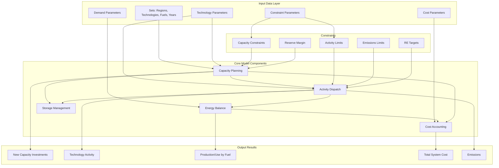
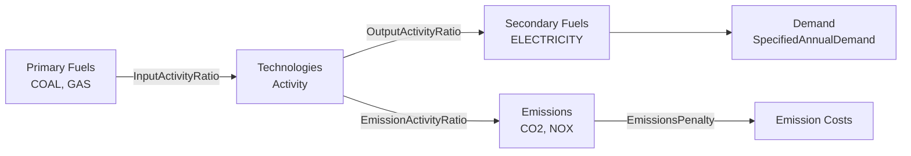
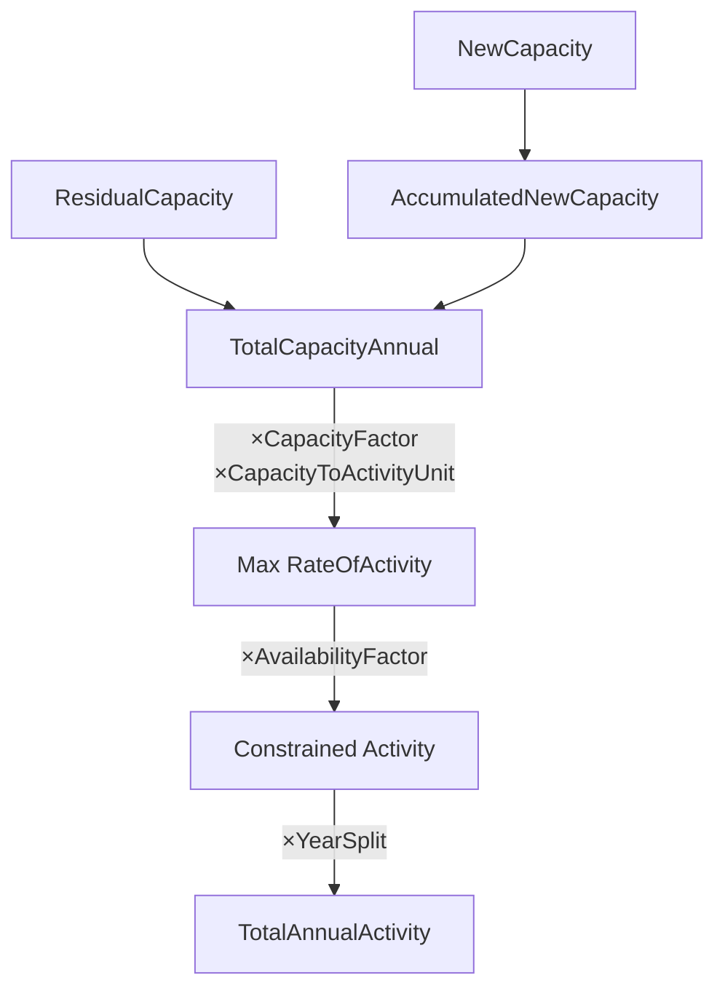
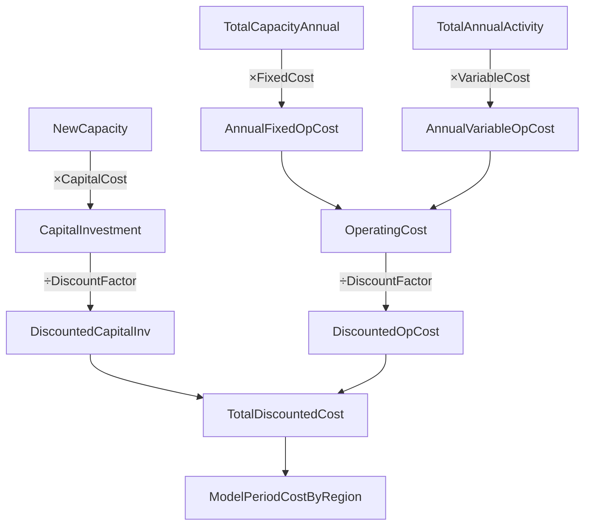

# OSeMOSYS: Open Source energy MOdeling SYStem

## Table of Contents
1. [Overview](#overview)
2. [Model Architecture](#model-architecture)
3. [Sets (Dimensions)](#sets-dimensions)
4. [Parameters (Input Data)](#parameters-input-data)
5. [Variables (Model Outputs)](#variables-model-outputs)
6. [Data Setup Guide](#data-setup-guide)
7. [Parameter Interactions](#parameter-interactions)
8. [Running the Model](#running-the-model)

## Overview

OSeMOSYS is a linear programming optimization model for long-term energy system planning. It minimizes the total discounted system cost while meeting energy demands and respecting technical, environmental, and policy constraints.

**Objective Function**: Minimize total discounted cost across all regions and years

## Model Architecture



## Sets (Dimensions)

Sets define the dimensions over which the model operates. All parameters and variables are indexed by combinations of these sets.

| Set | Description | Example Values |
|-----|-------------|----------------|
| **YEAR** | Planning horizon years | 2020, 2025, 2030, 2035, 2040, 2045, 2050 |
| **TECHNOLOGY** | Energy technologies | COAL_PP (coal power plant), WIND, SOLAR_PV, GAS_TURBINE |
| **TIMESLICE** | Time divisions within a year | S1D1H1 (Season 1, Day 1, Hour 1) |
| **FUEL** | Energy carriers | COAL, GAS, ELECTRICITY, OIL, URANIUM |
| **EMISSION** | Emission types | CO2, NOX, SO2, PM10 |
| **MODE_OF_OPERATION** | Technology operating modes | MODE1, MODE2 (e.g., different efficiency levels) |
| **REGION** | Geographic regions | REGION1, NORTH, SOUTH, URBAN |
| **SEASON** | Seasons within a year | WINTER, SPRING, SUMMER, FALL |
| **DAYTYPE** | Day types within seasons | WEEKDAY, WEEKEND |
| **DAILYTIMEBRACKET** | Time brackets within a day | MORNING, AFTERNOON, EVENING, NIGHT |
| **STORAGE** | Storage technologies | BATTERY, PUMPED_HYDRO, HYDROGEN_STORAGE |

### Timeslice Structure
Timeslices are hierarchical: **TIMESLICE = SEASON × DAYTYPE × DAILYTIMEBRACKET**

Example: If you have 4 seasons, 2 day types, and 3 daily time brackets, you'll have 24 timeslices.

## Parameters (Input Data)

### 1. Global Parameters

#### YearSplit[l, y]
- **Purpose**: Fraction of year represented by each timeslice
- **Range**: 0 to 1
- **Constraint**: Sum across all timeslices in a year must equal 1
- **Example**: If you have 8760 hours in a year and a timeslice represents 1095 hours, YearSplit = 1095/8760 = 0.125

#### DiscountRate[r]
- **Purpose**: Discount rate for economic calculations (as decimal)
- **Range**: 0 to 1 (typically 0.05 to 0.10)
- **Example**: 0.05 = 5% discount rate

#### DaySplit[lh, y]
- **Purpose**: Fraction of day represented by each daily time bracket
- **Range**: 0 to 1
- **Constraint**: Sum across all daily time brackets must equal 1
- **Default**: 0.00137 (Python version)

#### Conversionls[l, ls], Conversionld[l, ld], Conversionlh[l, lh]
- **Purpose**: Binary mapping of timeslices to seasons/daytypes/daily brackets
- **Range**: 0 or 1
- **Use**: Links timeslices to their hierarchical components

#### DaysInDayType[ls, ld, y]
- **Purpose**: Number of days of each day type in each season
- **Example**: 65 weekdays in summer, 26 weekend days in summer

#### TradeRoute[r, rr, f, y]
- **Purpose**: Binary indicator if trade route exists between regions
- **Range**: 0 or 1
- **Use**: Enables energy trade between regions

#### DepreciationMethod[r]
- **Purpose**: Depreciation calculation method
- **Values**: 
  - 1 = Sinking fund depreciation
  - 2 = Straight-line depreciation

---

### 2. Demand Parameters

#### SpecifiedAnnualDemand[r, f, y]
- **Purpose**: Total annual energy demand for each fuel
- **Units**: Energy units (PJ, TWh, etc.)
- **Example**: ELECTRICITY demand in 2030 = 500 PJ

#### SpecifiedDemandProfile[r, f, l, y]
- **Purpose**: Fraction of annual demand occurring in each timeslice
- **Range**: 0 to 1
- **Constraint**: Sum across all timeslices should equal 1
- **Use**: Distributes annual demand across time periods
- **Example**: 0.15 = 15% of annual electricity demand occurs in this timeslice

#### AccumulatedAnnualDemand[r, f, y]
- **Purpose**: Additional annual demand not distributed by profile
- **Units**: Energy units
- **Use**: Represents demand that isn't time-dependent

---

### 3. Performance Parameters

#### CapacityToActivityUnit[r, t]
- **Purpose**: Conversion factor from capacity to activity
- **Units**: Activity per capacity unit
- **Example**: 31.536 (converts GW to PJ/year: 1 GW × 8760 hours × 3.6 = 31.536 PJ)

#### CapacityFactor[r, t, l, y]
- **Purpose**: Maximum fraction of capacity available in each timeslice
- **Range**: 0 to 1
- **Example**: 
  - Solar PV at night = 0
  - Solar PV at noon = 0.8
  - Baseload plant = 0.95

#### AvailabilityFactor[r, t, y]
- **Purpose**: Annual average availability accounting for maintenance
- **Range**: 0 to 1
- **Example**: 0.85 = 85% availability (15% downtime for maintenance)

#### OperationalLife[r, t]
- **Purpose**: Lifespan of technology in years
- **Example**: Coal plant = 40 years, Solar PV = 25 years

#### ResidualCapacity[r, t, y]
- **Purpose**: Existing capacity at start of model period
- **Units**: Capacity units (GW, MW, etc.)
- **Use**: Represents pre-existing infrastructure

#### InputActivityRatio[r, t, f, m, y]
- **Purpose**: Units of fuel consumed per unit of activity
- **Units**: Fuel per activity unit
- **Example**: Gas turbine consuming 2.5 PJ of gas per PJ of activity
- **Note**: Set to 0 if technology doesn't use this fuel

#### OutputActivityRatio[r, t, f, m, y]
- **Purpose**: Units of fuel produced per unit of activity
- **Units**: Fuel per activity unit
- **Example**: Power plant producing 1 PJ of electricity per PJ of activity
- **Note**: Set to 0 if technology doesn't produce this fuel

---

### 4. Technology Cost Parameters

#### CapitalCost[r, t, y]
- **Purpose**: Capital cost per unit of new capacity
- **Units**: Currency per capacity unit ($/GW, $/MW)
- **Example**: Solar PV = 1,000,000 $/MW in 2030

#### VariableCost[r, t, m, y]
- **Purpose**: Variable operating cost per unit of activity
- **Units**: Currency per activity unit ($/PJ)
- **Example**: Fuel cost + O&M = 5 $/PJ

#### FixedCost[r, t, y]
- **Purpose**: Fixed annual O&M cost per unit of capacity
- **Units**: Currency per capacity unit per year ($/GW/year)
- **Example**: 40,000 $/MW/year

---

### 5. Storage Parameters

#### TechnologyToStorage[r, t, s, m]
- **Purpose**: Rate at which technology charges storage
- **Units**: Storage units per activity unit
- **Example**: 1.0 = 1:1 charging efficiency

#### TechnologyFromStorage[r, t, s, m]
- **Purpose**: Rate at which technology discharges storage
- **Units**: Storage units per activity unit
- **Example**: 0.9 = 90% discharge efficiency

#### StorageLevelStart[r, s]
- **Purpose**: Initial storage level at model start
- **Units**: Energy units (PJ, TWh)
- **Default**: 0.0000001 (small positive value)

#### StorageMaxChargeRate[r, s]
- **Purpose**: Maximum charging rate
- **Units**: Energy per time period
- **Default**: 99999 (effectively unlimited)

#### StorageMaxDischargeRate[r, s]
- **Purpose**: Maximum discharge rate
- **Units**: Energy per time period
- **Default**: 99999 (effectively unlimited)

#### MinStorageCharge[r, s, y]
- **Purpose**: Minimum storage level as fraction of capacity
- **Range**: 0 to 1
- **Example**: 0.2 = must maintain 20% minimum charge

#### OperationalLifeStorage[r, s]
- **Purpose**: Lifespan of storage technology in years
- **Example**: Battery = 15 years, Pumped hydro = 80 years

#### CapitalCostStorage[r, s, y]
- **Purpose**: Capital cost per unit of storage capacity
- **Units**: Currency per storage capacity unit ($/GWh)

#### ResidualStorageCapacity[r, s, y]
- **Purpose**: Existing storage capacity
- **Units**: Storage capacity units (GWh, etc.)

---

### 6. Capacity Constraint Parameters

#### CapacityOfOneTechnologyUnit[r, t, y]
- **Purpose**: Capacity of discrete technology units (if lumpy investments)
- **Units**: Capacity units per unit
- **Example**: Nuclear plant = 1000 MW (must build in 1 GW increments)
- **Note**: Set to 0 for continuous capacity investments

#### TotalAnnualMaxCapacity[r, t, y]
- **Purpose**: Maximum total capacity allowed
- **Units**: Capacity units
- **Default**: 99999 (effectively unlimited)

#### TotalAnnualMinCapacity[r, t, y]
- **Purpose**: Minimum total capacity required
- **Units**: Capacity units
- **Example**: Require at least 500 MW of solar by 2030

---

### 7. Investment Constraint Parameters

#### TotalAnnualMaxCapacityInvestment[r, t, y]
- **Purpose**: Maximum new capacity that can be added in a year
- **Units**: Capacity units
- **Use**: Limits deployment rate

#### TotalAnnualMinCapacityInvestment[r, t, y]
- **Purpose**: Minimum new capacity required in a year
- **Units**: Capacity units
- **Use**: Forces minimum deployment

---

### 8. Activity Constraint Parameters

#### TotalTechnologyAnnualActivityUpperLimit[r, t, y]
- **Purpose**: Maximum annual activity for technology
- **Units**: Activity units (PJ)
- **Default**: 99999

#### TotalTechnologyAnnualActivityLowerLimit[r, t, y]
- **Purpose**: Minimum annual activity for technology
- **Units**: Activity units (PJ)
- **Use**: Ensures minimum utilization

#### TotalTechnologyModelPeriodActivityUpperLimit[r, t]
- **Purpose**: Maximum cumulative activity over entire model period
- **Units**: Activity units (PJ)

#### TotalTechnologyModelPeriodActivityLowerLimit[r, t]
- **Purpose**: Minimum cumulative activity over entire model period
- **Units**: Activity units (PJ)

---

### 9. Reserve Margin Parameters

#### ReserveMarginTagTechnology[r, t, y]
- **Purpose**: Binary indicator if technology contributes to reserve margin
- **Range**: 0 or 1
- **Example**: 1 for dispatchable plants, 0 for wind/solar

#### ReserveMarginTagFuel[r, f, y]
- **Purpose**: Binary indicator if fuel requires reserve margin
- **Range**: 0 or 1
- **Example**: 1 for electricity, 0 for transport fuels

#### ReserveMargin[r, y]
- **Purpose**: Required reserve margin as fraction of demand
- **Range**: >1 (e.g., 1.15 = 115% = 15% reserve margin)
- **Example**: 1.20 = 20% reserve capacity above peak demand

---

### 10. Renewable Energy Target Parameters

#### RETagTechnology[r, t, y]
- **Purpose**: Binary indicator if technology counts as renewable
- **Range**: 0 or 1
- **Example**: 1 for wind/solar, 0 for fossil fuels

#### RETagFuel[r, f, y]
- **Purpose**: Binary indicator if fuel is subject to RE target
- **Range**: 0 or 1
- **Example**: 1 for electricity, 0 for other fuels

#### REMinProductionTarget[r, y]
- **Purpose**: Minimum fraction of target fuel from renewable sources
- **Range**: 0 to 1
- **Example**: 0.3 = 30% of electricity from renewables

---

### 11. Emissions Parameters

#### EmissionActivityRatio[r, t, e, m, y]
- **Purpose**: Emissions per unit of activity
- **Units**: Emission units per activity unit (Mt CO2/PJ)
- **Example**: Coal plant = 0.095 Mt CO2/PJ

#### EmissionsPenalty[r, e, y]
- **Purpose**: Cost penalty per unit of emissions
- **Units**: Currency per emission unit ($/tonne CO2)
- **Example**: Carbon price = 50 $/tonne CO2

#### AnnualExogenousEmission[r, e, y]
- **Purpose**: Emissions from sources outside the model
- **Units**: Emission units (Mt)

#### AnnualEmissionLimit[r, e, y]
- **Purpose**: Maximum annual emissions allowed
- **Units**: Emission units (Mt)
- **Default**: 99999 (unlimited)

#### ModelPeriodExogenousEmission[r, e]
- **Purpose**: Total exogenous emissions over model period
- **Units**: Emission units (Mt)

#### ModelPeriodEmissionLimit[r, e]
- **Purpose**: Total emissions allowed over entire model period
- **Units**: Emission units (Mt)
- **Example**: Cumulative CO2 budget = 1000 Mt

---

## Variables (Model Outputs)

Variables are calculated by the optimization model. Key output variables include:

### Capacity Variables
- **NewCapacity[r, t, y]**: New capacity installed in each year
- **AccumulatedNewCapacity[r, t, y]**: Total accumulated new capacity still operational
- **TotalCapacityAnnual[r, t, y]**: Total capacity (new + residual)

### Activity Variables
- **RateOfActivity[r, l, t, m, y]**: Technology activity rate in each timeslice
- **TotalTechnologyAnnualActivity[r, t, y]**: Total annual technology activity
- **RateOfProduction[r, l, f, y]**: Total fuel production rate
- **RateOfUse[r, l, f, y]**: Total fuel consumption rate

### Storage Variables
- **StorageLevelYearStart[r, s, y]**: Storage level at start of year
- **RateOfStorageCharge[r, s, ls, ld, lh, y]**: Storage charging rate
- **RateOfStorageDischarge[r, s, ls, ld, lh, y]**: Storage discharge rate

### Cost Variables
- **CapitalInvestment[r, t, y]**: Undiscounted capital investment
- **OperatingCost[r, t, y]**: Annual operating cost
- **TotalDiscountedCost[r, y]**: Total discounted system cost

### Emissions Variables
- **AnnualEmissions[r, e, y]**: Total annual emissions by type
- **ModelPeriodEmissions[r, e]**: Total emissions over model period

---

## Data Setup Guide

### Step 1: Define Sets

Create data files defining all sets. For Python (Pyomo), use a .dat file:

```
set YEAR := 2020 2025 2030 2035 2040 2045 2050;

set REGION := REGION1;

set TECHNOLOGY := 
    COAL_PP
    GAS_CCGT
    NUCLEAR
    SOLAR_PV
    WIND_ONSHORE
    HYDRO;

set FUEL := 
    COAL
    GAS
    URANIUM
    ELECTRICITY;

set EMISSION := CO2 NOX SO2;

set MODE_OF_OPERATION := MODE1;

set TIMESLICE := 
    S1D1H1 S1D1H2 S1D1H3
    S1D2H1 S1D2H2 S1D2H3;

set SEASON := S1;
set DAYTYPE := D1 D2;
set DAILYTIMEBRACKET := H1 H2 H3;

set STORAGE := BATTERY PUMPED_HYDRO;
```

### Step 2: Set Global Parameters

```
param DiscountRate :=
    REGION1 0.05;

param YearSplit :=
    [*, 2020]
    S1D1H1 0.333
    S1D1H2 0.333
    S1D1H3 0.334
    # ... repeat for all timeslices and years
    ;
```

### Step 3: Define Technology Characteristics

```
param OperationalLife :=
    REGION1 COAL_PP 40
    REGION1 GAS_CCGT 30
    REGION1 NUCLEAR 60
    REGION1 SOLAR_PV 25
    REGION1 WIND_ONSHORE 25
    REGION1 HYDRO 80;

param CapacityToActivityUnit :=
    REGION1 COAL_PP 31.536
    REGION1 GAS_CCGT 31.536
    # ... (converts GW to PJ/year)
    ;

param CapacityFactor :=
    [REGION1, COAL_PP, *, *] :=
        [*, 2020]
        S1D1H1 0.85
        S1D1H2 0.85
        # ... all timeslices
    [REGION1, SOLAR_PV, *, *] :=
        [*, 2020]
        S1D1H1 0.0    # Night
        S1D1H2 0.7    # Day
        S1D1H3 0.0    # Evening
    ;
```

### Step 4: Define Input/Output Ratios

```
param InputActivityRatio :=
    # Coal plant consumes coal
    [REGION1, COAL_PP, COAL, MODE1, *] :=
        2020 2.5
        2025 2.5
        2030 2.5
    # Gas plant consumes gas
    [REGION1, GAS_CCGT, GAS, MODE1, *] :=
        2020 1.8
        2025 1.8
        2030 1.8
    ;

param OutputActivityRatio :=
    # All plants produce electricity
    [REGION1, COAL_PP, ELECTRICITY, MODE1, *] :=
        2020 1.0
        2025 1.0
        2030 1.0
    [REGION1, GAS_CCGT, ELECTRICITY, MODE1, *] :=
        2020 1.0
        2025 1.0
        2030 1.0
    ;
```

### Step 5: Define Costs

```
param CapitalCost :=
    [REGION1, *, *] :
        2020 2025 2030 :=
    COAL_PP     2000000 2100000 2200000
    GAS_CCGT    1000000 1000000 1000000
    SOLAR_PV    1200000 1000000  800000
    WIND_ONSHORE 1500000 1400000 1300000;

param FixedCost :=
    [REGION1, *, *] :
        2020 2025 2030 :=
    COAL_PP     40000 42000 44000
    GAS_CCGT    20000 21000 22000
    SOLAR_PV    15000 14000 13000;

param VariableCost :=
    [REGION1, *, MODE1, *] :
        2020 2025 2030 :=
    COAL_PP     2.5 2.7 3.0
    GAS_CCGT    4.0 4.5 5.0
    SOLAR_PV    0.0 0.0 0.0;
```

### Step 6: Define Demand

```
param SpecifiedAnnualDemand :=
    [REGION1, ELECTRICITY, *] :=
        2020 500
        2025 550
        2030 600
        2035 650
        2040 700;

param SpecifiedDemandProfile :=
    [REGION1, ELECTRICITY, *, 2020] :=
        S1D1H1 0.05  # Night
        S1D1H2 0.15  # Day
        S1D1H3 0.10  # Evening
    # ... must sum to 1.0 across all timeslices
    ;
```

### Step 7: Define Emissions

```
param EmissionActivityRatio :=
    [REGION1, COAL_PP, CO2, MODE1, *] :=
        2020 0.095
        2025 0.095
        2030 0.095
    [REGION1, GAS_CCGT, CO2, MODE1, *] :=
        2020 0.045
        2025 0.045
        2030 0.045;

param AnnualEmissionLimit :=
    [REGION1, CO2, *] :=
        2020 100
        2025 90
        2030 80
        2035 70
        2040 60;
```

---

## Parameter Interactions

### Energy Flow Chain


### Capacity-Activity Relationship


### Cost Calculation Flow


### Key Interaction Rules

1. **Energy Balance**: Production ≥ Demand + Use + Trade
   ```
   ∑(RateOfProduction) ≥ RateOfDemand + RateOfUse + ∑(Trade)
   ```

2. **Capacity Constraint**: Activity ≤ Capacity × CapacityFactor
   ```
   RateOfActivity ≤ TotalCapacity × CapacityFactor × CapacityToActivityUnit
   ```

3. **Fuel Conversion**: 
   ```
   FuelOut = Activity × OutputActivityRatio
   FuelIn = Activity × InputActivityRatio
   ```

4. **Reserve Margin**:
   ```
   ∑(Capacity × ReserveMarginTag) ≥ PeakDemand × ReserveMargin
   ```

5. **RE Target**:
   ```
   ∑(RE_Production) ≥ REMinTarget × ∑(TotalTargetFuelProduction)
   ```

---

## Running the Model

### Python (Pyomo) Version

1. **Install Pyomo and solver**:
   ```bash
   pip install pyomo
   # Install GLPK or other LP solver
   ```

2. **Create data file** (`data.dat`) with all parameters

3. **Run model**:
   ```python
   from pyomo.environ import *
   from pyomo.opt import SolverFactory
   
   # Create model instance
   model = AbstractModel()
   # ... (include all model code)
   
   # Load data and create instance
   instance = model.create_instance('data.dat')
   
   # Solve
   solver = SolverFactory('glpk')
   results = solver.solve(instance)
   
   # Extract results
   instance.solutions.load_from(results)
   ```

### GMPL (.txt) Version

1. **Install GLPK**:
   ```bash
   # On Ubuntu/Debian
   sudo apt-get install glpk-utils
   
   # On MacOS
   brew install glpk
   ```

2. **Create data file** (`datafile.txt`) in GMPL format

3. **Run model**:
   ```bash
   glpsol -m osemosys.txt -d datafile.txt -o results.txt
   ```

### Output Files

Both versions produce CSV files with results:
- `NewCapacity.csv`: New capacity investments
- `TotalCapacityAnnual.csv`: Total capacity by year
- `ProductionByTechnology.csv`: Energy production
- `AnnualEmissions.csv`: Emissions by year
- `TotalDiscountedCost.csv`: System costs
- And many more detailed outputs...

---

## Tips for Model Setup

### 1. Start Simple
- Begin with 1 region, 3-4 technologies, 2-3 fuels
- Use simplified timeslice structure (e.g., 4-6 timeslices)
- Add complexity gradually

### 2. Data Consistency Checks
- Ensure YearSplit sums to 1.0 for each year
- Verify SpecifiedDemandProfile sums to 1.0
- Check that InputActivityRatio and OutputActivityRatio make physical sense
- Validate that CapacityFactor values are between 0 and 1

### 3. Units Consistency
- Use consistent energy units throughout (PJ or TWh)
- Ensure CapacityToActivityUnit converts your capacity units to activity units correctly
- Keep cost units consistent (e.g., million USD)

### 4. Solver Selection
- GLPK: Free, suitable for small-medium models
- CBC: Free, faster than GLPK for larger models
- CPLEX/Gurobi: Commercial, best for large models

### 5. Debugging
- If model is infeasible, check:
  - Demand can be met with available/buildable capacity
  - Emission limits aren't too restrictive
  - Capacity constraints aren't contradictory
  - All required input fuels are available

### 6. Common Pitfalls
- Forgetting to set OutputActivityRatio for a technology's product
- Setting both TotalAnnualMax and TotalAnnualMin to conflicting values
- Not accounting for conversion losses (InputActivityRatio > OutputActivityRatio)
- Inconsistent timeslice definitions between parameters

---

## Further Resources

- **Official Documentation**: www.osemosys.org
- **GitHub Repository**: github.com/OSeMOSYS
- **Example Models**: Available in the OSeMOSYS repository