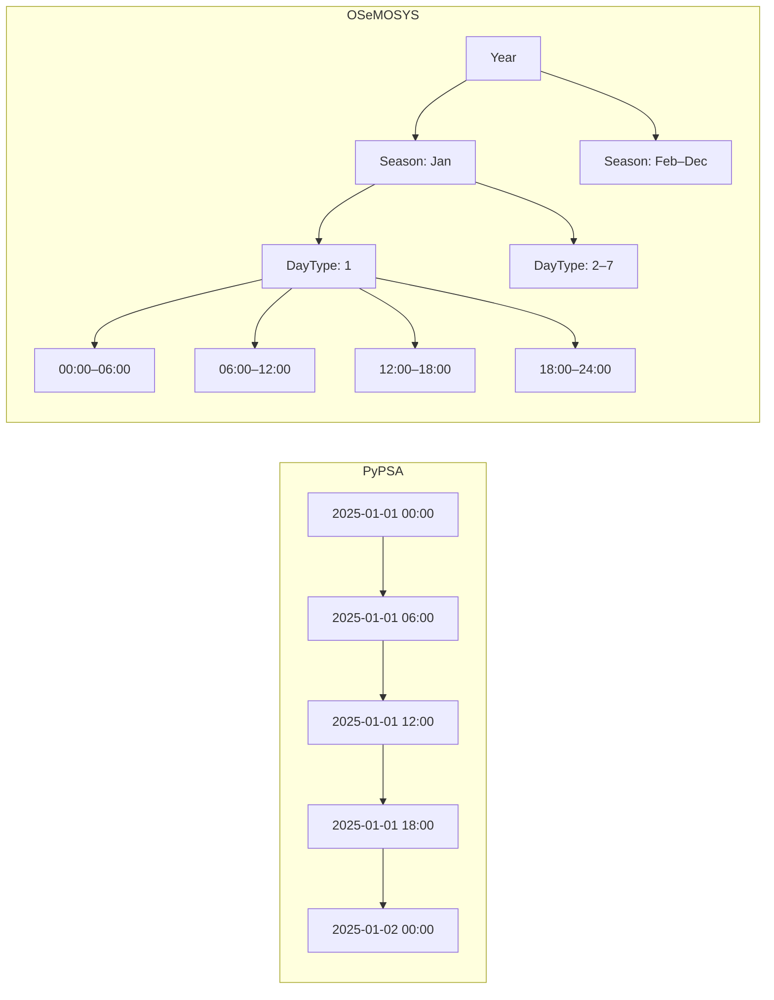
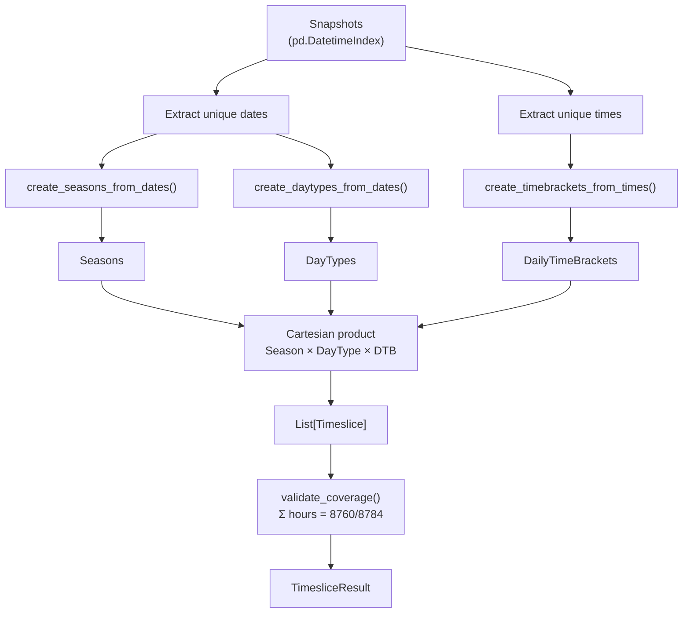
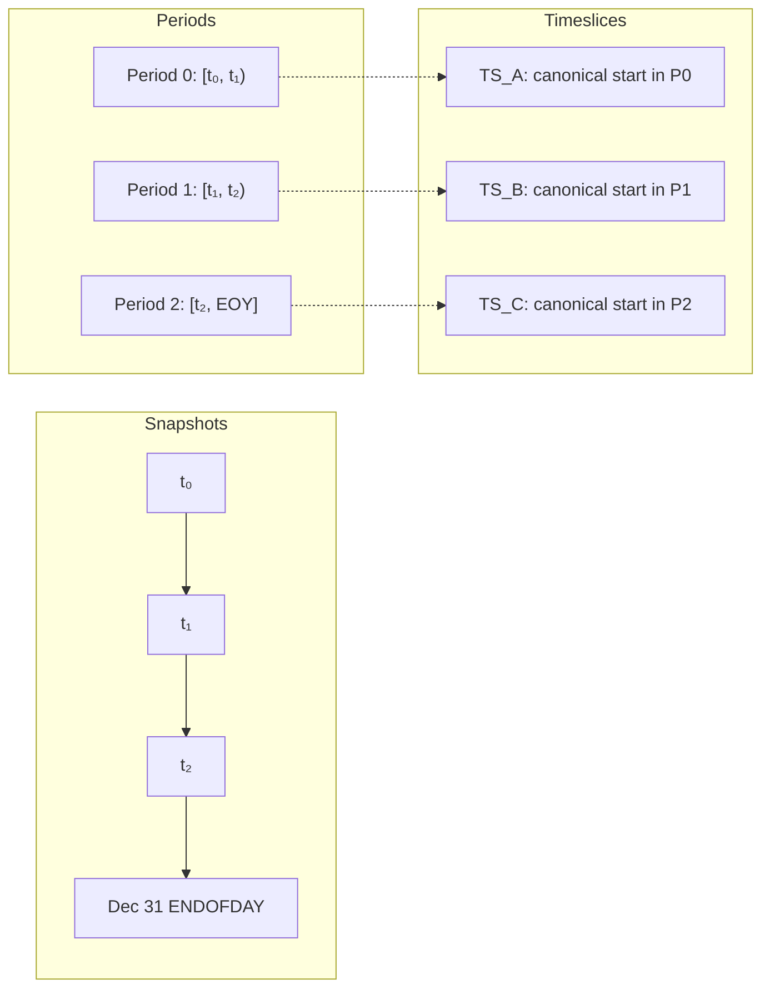
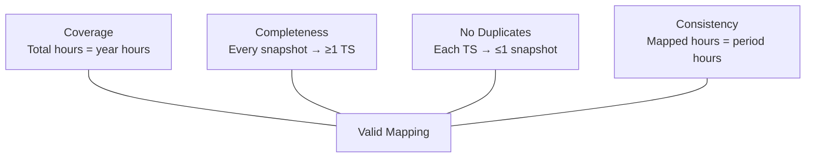

# Time Translation: PyPSA ↔ OSeMOSYS

This document explains how `pyoscomp` translates between PyPSA's sequential-snapshot time representation and OSeMOSYS's hierarchical-timeslice time representation.

---

## 1. Two Time Representations

| Aspect | PyPSA | OSeMOSYS |
|---|---|---|
| Structure | Flat sequence of timestamps | Hierarchical tree: Season → DayType → DailyTimeBracket |
| Granularity | Any `DatetimeIndex` (hourly, daily, irregular) | Categorical labels that partition the year |
| Duration | Implicit: gap between consecutive timestamps | Explicit: each timeslice carries a `YearSplit` weight |
| Year handling | Multi-year series with explicit dates | Single timeslice definition reused across model years |



---

## 2. Data Structures

### Season

Represents a contiguous range of **months** within a year.

```python
Season(month_start=1, month_end=6)   # Jan through Jun
Season(month_start=7, month_end=12)  # Jul through Dec
```

### DayType

Represents a contiguous range of **days within a month** (max 7 days).

```python
DayType(day_start=1, day_end=7)    # Days 1–7 of each month in the season
DayType(day_start=15, day_end=15)  # The 15th of each month
```

Days that don't exist in a given month (e.g., day 31 in February) have zero duration.

### DailyTimeBracket

Represents a contiguous **time-of-day** range using half-open intervals `[start, end)`.

```python
DailyTimeBracket(time(0, 0), time(12, 0))   # Midnight to noon
DailyTimeBracket(time(12, 0), ENDOFDAY)      # Noon to end of day
```

`ENDOFDAY = time(23, 59, 59, 999999)` represents the last microsecond of the day.

### Timeslice

The Cartesian product of the three:

```
Timeslice = Season × DayType × DailyTimeBracket
```

Each Timeslice identifies a unique temporal pattern within the year. Its **duration** in a specific year is the sum of all matching hours across all months in the season.

---

## 3. Forward Translation: `to_timeslices()`

Converts PyPSA snapshots → OSeMOSYS timeslice structure.



### Algorithm

1. **Parse snapshots** — validate, convert to `pd.DatetimeIndex`, sort.
2. **Extract years** — `sorted(snapshots.year.unique())`.
3. **Decompose dates** — unique dates → `create_seasons_from_dates` (month ranges) and `create_daytypes_from_dates` (day-of-month ranges, max 7 days each).
4. **Decompose times** — unique times → `create_timebrackets_from_times` (partition the 24-hour day).
5. **Form timeslices** — Cartesian product of all Seasons × DayTypes × DailyTimeBrackets.
6. **Validate** — assert `Σ ts.duration_hours(year) == hours_in_year(year)` for every year.

### Date Decomposition Example

Given snapshots on Jan 15, Jun 15, and Nov 15:

```
Months observed: {1, 6, 11}

Seasons created:
  Season(1, 1)     ← January
  Season(2, 5)     ← gap: Feb–May
  Season(6, 6)     ← June
  Season(7, 10)    ← gap: Jul–Oct
  Season(11, 11)   ← November
  Season(12, 12)   ← gap: December

Days observed: {15}

DayTypes created:
  DayType(1, 7)    ← gap-fill
  DayType(8, 14)   ← gap-fill
  DayType(15, 15)  ← observed day
  DayType(16, 21)  ← gap-fill
  DayType(22, 28)  ← gap-fill
  DayType(29, 31)  ← gap-fill
```

---

## 4. Snapshot-to-Timeslice Mapping: `create_map()`

After building the timeslice structure, `create_map()` assigns each timeslice to the snapshot whose data applies to it.

### Semantics

- Snapshot *i* represents data valid for the period **[t_i, t_{i+1})**.
- The last snapshot is valid until **Dec 31 23:59:59.999999** of its year.
- Timeslice *TS* in year *Y* is assigned to the snapshot whose period contains the timeslice's **canonical start**.



### Canonical Start

For a timeslice TS = (Season, DayType, DTB) in year Y, the **canonical start** is the earliest `pd.Timestamp` at which the pattern occurs:

```
canonical_start(TS, Y) = Timestamp(
    year  = Y,
    month = first month m in [season.month_start, season.month_end]
            where daytype.to_dates(Y, m) is valid,
    day   = daytype.day_start,
    time  = dailytimebracket.hour_start
)
```

Returns `None` if no valid date exists (e.g., DayType(31, 31) in Season(2, 2) during a non-leap year — February never has 31 days).

### Why Canonical Start Works

Since `to_timeslices()` creates Seasons from snapshot months and DayTypes from snapshot days, the decomposition guarantees that **all occurrences of a timeslice's pattern fall within a single snapshot period.** The canonical start (earliest occurrence) is therefore a correct representative for the whole pattern.

### Year Boundary Handling

`create_endpoints()` augments the snapshot list with start-of-year and end-of-year timestamps for **every year** from min to max (including intermediate years with no snapshots). This allows snapshot periods to be correctly split at year boundaries:

```
Snapshots:  [2020-01-01, 2022-01-01]
Endpoints:  [2020-01-01, 2020-12-31T23:59:59.999999,
             2021-01-01, 2021-12-31T23:59:59.999999,
             2022-01-01, 2022-12-31T23:59:59.999999]
```

The first snapshot's period [2020-01-01, 2022-01-01) spans both 2020 and 2021. Timeslices in both years are correctly assigned to this snapshot.

### Validation

After mapping, the function validates:

```
|Σ mapped_ts.duration_hours(y) − expected_period_hours| < 1 second
```

for each snapshot period. A mismatch raises `ValueError`.

---

## 5. Inverse Translation: `to_snapshots()`

Converts OSeMOSYS timeslice definitions → PyPSA snapshot `DatetimeIndex`.

This reads the OSeMOSYS `TimeComponent` data (years, timeslices, year-splits) and generates a `pd.MultiIndex` of `(year, timeslice_name)` pairs for use as PyPSA's snapshot index.

---

## 6. Edge Cases

### Leap Years

- `hours_in_year(2020)` = 8784 (366 × 24), `hours_in_year(2021)` = 8760.
- `DayType(29, 29)` in `Season(2, 2)`:
  - **Leap year**: duration = 24 hours (Feb 29 exists).
  - **Non-leap year**: duration = 0 hours (Feb 29 doesn't exist; `to_dates()` returns `(None, None)`).
- Timeslices with zero duration are skipped during mapping.

### Non-Existent Days

`DayType(31, 31)` in months with fewer days:
- April (30 days): duration = 0; canonical start returns `None`.
- March (31 days): duration = 24 h; canonical start = Mar 31.
- Multi-month season `Season(2, 3)` + `DayType(31, 31)`: Feb skipped, canonical start = Mar 31.

### Non-Sequential Snapshots

`create_map()` sorts snapshots internally. Duplicate timestamps are deduplicated by `pd.DatetimeIndex`. Out-of-order snapshots produce the same mapping as sorted ones.

### Snapshots Not Starting at Jan 1

If the first snapshot is mid-year, timeslices before it are **not mapped** to any snapshot. This is by design: snapshot data is valid **forward** from its timestamp.

```
First snapshot: Jun 15
Mapped:   [Jun 15, Dec 31]  ← timeslices in this range
Unmapped: [Jan 1, Jun 15)   ← no snapshot data applies
```

### Year Gaps

Snapshots in 2020 and 2022 with no 2021 snapshot: the first snapshot's period spans all of 2020 and 2021. All timeslices in 2021 are assigned to the 2020 snapshot.

---

## 7. Invariants

The system maintains four invariants:

| Invariant | Description | Verified by |
|---|---|---|
| **Coverage** | `Σ ts.duration_hours(Y) = hours_in_year(Y)` for each year | `TimesliceResult.validate_coverage()` |
| **Completeness** | Every snapshot has ≥ 1 mapped timeslice | `create_map()` |
| **No Duplicates** | Each `(year, timeslice)` pair appears in at most one snapshot | `create_map()` |
| **Consistency** | Mapped hours = snapshot period hours (±1 second) | `create_map()` validation |



---

## 8. Usage Example

```python
import pandas as pd
from pyoscomp.translation.time import to_timeslices, create_map

# 1. Create snapshots
snapshots = pd.date_range('2025-01-01', periods=8760, freq='h')

# 2. Build timeslice structure
result = to_timeslices(snapshots)
print(f"Seasons: {len(result.seasons)}")
print(f"DayTypes: {len(result.daytypes)}")
print(f"DTBs: {len(result.dailytimebrackets)}")
print(f"Timeslices: {len(result.timeslices)}")

# 3. Map snapshots to timeslices
mapping = create_map(snapshots, result.timeslices)
for snap in list(mapping.keys())[:3]:
    n = len(mapping[snap])
    dur = sum(ts.duration_hours(y) for y, ts in mapping[snap])
    print(f"{snap} → {n} timeslice(s), {dur:.1f} hours")

# 4. Export to OSeMOSYS CSV
csv_dict = result.export()
for name, df in csv_dict.items():
    df.to_csv(f'{name}.csv', index=False)
```
