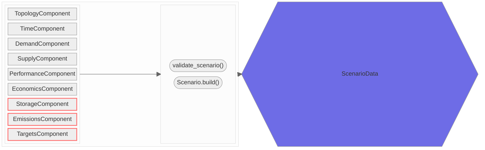

**Legend**
> names of relevant pyoscomp module(s)

A, B = Class Object (TODO)
C = Function or Class Method
D = DataClass Object

---
### 1. Scenario Authoring
> modules: `scenario`, `interfaces`

---
### 2. Translation to Model Input
> modules: `interfaces`, `translation`
---
### 3. Model Execution
> modules: `runners`
---
### 4. Translation of Model Output
> modules: `translation`, `interfaces`
---
### 5. Post-processing & Comparison
> 
---