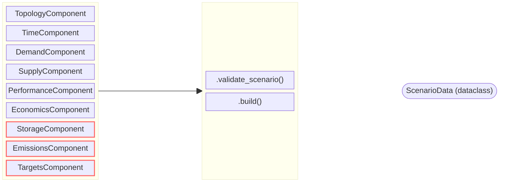
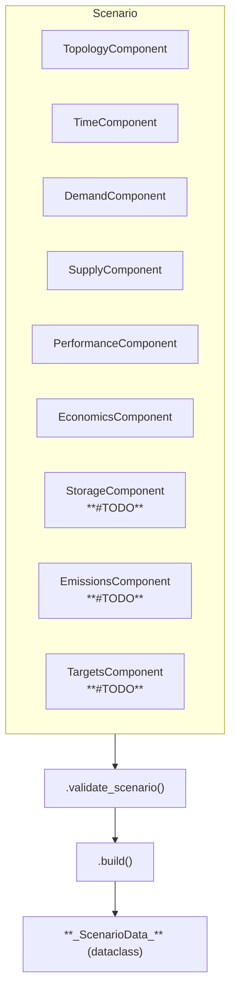
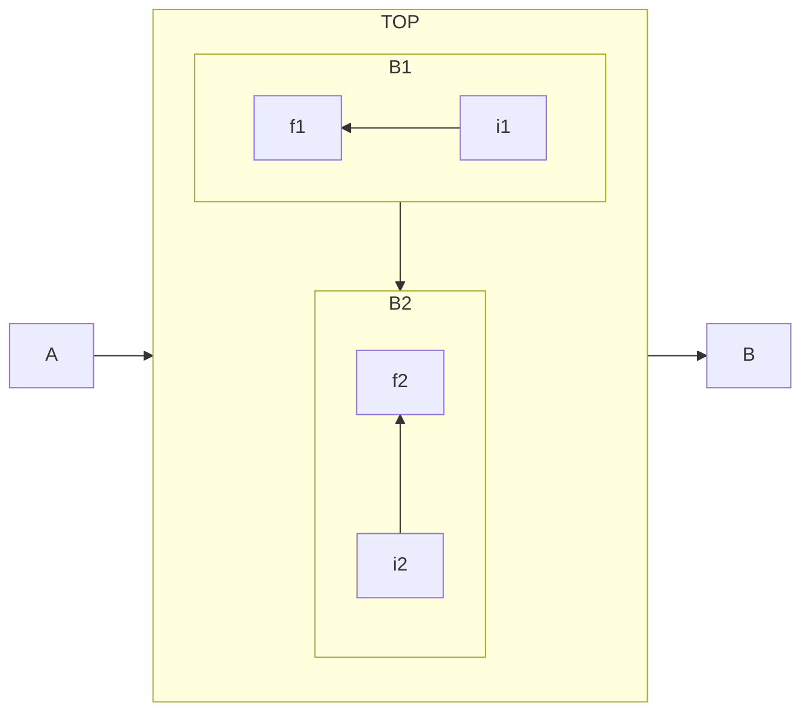

```mermaid
block

    columns 5
    block:group1
        columns 1
        T1["TopologyComponent"]
        T2["TimeComponent"]
        T3["DemandComponent"]
        T4["SupplyComponent"]
        T5["PerformanceComponent"]
        T6["EconomicsComponent"]
        T7["StorageComponent"]
        T8["EmissionsComponent"]
        T9["TargetsComponent"]
    end

    classDef TODO color:#f66,stroke:#f66,stroke-width:2px
    class T7 TODO
    class T8 TODO
    class T9 TODO

    space
    block:scenario
        columns 1
        space:3
        S1[".validate_scenario()"]
        S2[".build()"]
        space:3
    end
    group1 --> scenario
    space
    D(["ScenarioData (dataclass)"])
```

```mermaid

flowchart TB
    subgraph Scenario
        direction LR
        T1["TopologyComponent"]
        T2["TimeComponent"]
        T3["DemandComponent"]
        T4["SupplyComponent"]
        T5["PerformanceComponent"]
        T6["EconomicsComponent"]
        T7["StorageComponent <br/>**#TODO**"]
        T8["EmissionsComponent <br/>**#TODO**"]
        T9["TargetsComponent <br/>**#TODO**"]
    end
    Scenario --> B[".validate_scenario()"]
    B --> C[".build()"]
    C --> D["**_ScenarioData_** (dataclass)"]
```

```mermaid
flowchart LR
  subgraph TOP
    direction TB
    subgraph B1
        direction RL
        i1 -->f1
    end
    subgraph B2
        direction BT
        i2 -->f2
    end
  end
  A --> TOP --> B
  B1 --> B2

```

```mermaid

flowchart LR

	subgraph COMP["components"]
		T1["TopologyComponent"]
		T2["TimeComponent"]
		T3["DemandComponent"]
		T4["SupplyComponent"]
		T5["PerformanceComponent"]
		T6["EconomicsComponent"]
	end

	COMP --> A

	A(["Scenario Authoring<br/>(scenario module)"]):::green --> B["ScenarioData<br/>(interfaces module)"]
	B --> C["InputTranslators<br/>(translation module)"]
	C --> D1["PyPSA Model Execution<br/>(runners module)"]
	C --> D2["OSeMOSYS Model Execution<br/>(runners module)"]
	D1 --> E1["Raw PyPSA Outputs"]
	D2 --> E2["Raw OSeMOSYS Outputs"]
	E1 --> F1["OutputTranslators<br/>(translation module)"]
	E2 --> F2["OutputTranslators<br/>(translation module)"]
	F1 --> G["ModelResults<br/>(interfaces module)"]
	F2 --> G
	G --> H["compare()"]
	classDef green fill:#a3f7bf,stroke:#333,stroke-width:2,rx:20,ry:20;

```