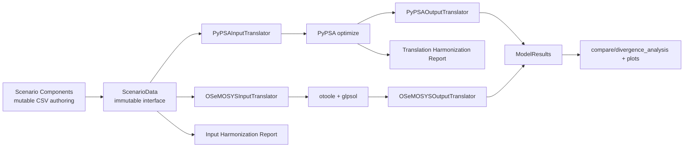

# PyOSComp

PyOSComp is a research-focused framework for comparing capacity-expansion
recommendations from OSeMOSYS and PyPSA under harmonized inputs. The core goal is
to isolate model-attributable uncertainty by keeping implementation differences as
small and explicit as possible.

## Related READMEs

- [Documentation Index](docs_index.md)
- [Scenario Module](scenario/README.md)
- [Scenario Components](scenario/components/README.md)
- [Scenario Validation](scenario/validation/README.md)
- [Interfaces Module](interfaces/README.md)
- [Translation Module](translation/README.md)
- [Time Translation Submodule](translation/time/README.md)
- [Runners Module](runners/README.md)

## What Is Implemented Today

- Mutable scenario authoring via `pyoscomp.scenario.components`.
- Immutable, validated transfer layer via `pyoscomp.interfaces.ScenarioData`.
- Input translators to both model ecosystems:
    - `PyPSAInputTranslator` -> `pypsa.Network`
    - `OSeMOSYSInputTranslator` -> otoole-compatible CSV/DataFrames
- Output translators from model outputs to harmonized `ModelResults`.
- Harmonization diagnostics at input and translation stages.
- Unified programmatic run entrypoint in `pyoscomp.run.run`.

## End-to-End Workflow


```mermaid
flowchart LR
        A[Scenario Components\nmutable CSV authoring] --> B[ScenarioData\nimmutable interface]
        B --> C[PyPSAInputTranslator]
        B --> D[OSeMOSYSInputTranslator]
        C --> E[PyPSA optimize]
        D --> F[otoole + glpsol]
        E --> G[PyPSAOutputTranslator]
        F --> H[OSeMOSYSOutputTranslator]
        G --> I[ModelResults]
        H --> I
        B --> J[Input Harmonization Report]
        E --> K[Translation Harmonization Report]
        I --> L[compare/divergence_analysis + plots]
```

## Module Map

| Module | Primary Role | Key Objects |
|---|---|---|
| `scenario` | Authoring OSeMOSYS-native scenario CSVs | `Scenario`, components |
| `interfaces` | Immutable contracts + validation + harmonization checks | `ScenarioData`, `ModelResults` |
| `translation` | Input/output translation between contracts and model formats | `PyPSAInputTranslator`, `OSeMOSYSOutputTranslator`, time translators |
| `runners` | Model execution wrappers | `PyPSARunner`, `OSeMOSYSRunner` |
| `run.py` | Unified orchestration helper | `run`, `run_pypsa`, `run_osemosys` |
| `visualization` | Harmonization and divergence plotting | `HarmonizationVisualizer` |

## Quickstart (From Existing Scenario CSV Directory)

```python
from pyoscomp.interfaces import ScenarioData
from pyoscomp.run import run

scenario_data = ScenarioData.from_directory("path/to/scenario")
comparison = run(
        scenario_data,
        model="both",
        pypsa_options={"solver_name": "highs"},
)

print(comparison.compare_objectives())
print(comparison.harmonization.get("npv_parity"))
```

## Important Edge Cases

- PyPSA multi-period runs require valid investment-period setup and compatible
    snapshot index structure.
- OSeMOSYS execution requires external binaries (`otoole`, `glpsol`) available in
    `PATH`.
- Time translation validates annual coverage (`8760`/`8784` hours); inconsistent
    `YearSplit` inputs fail validation.
- Storage is implemented, but some assumptions are structural (one StorageUnit in
    PyPSA corresponds to an OSeMOSYS storage triplet).

## Known Gaps / Improvement Opportunities

- CLI in `pyoscomp.__main__` is still placeholder-level.
- `TradeComponent` authoring remains stubbed.
- OSeMOSYS direct Pyomo path in runners is not implemented.
- Additional strict consistency checks (for example, stronger profile-range checks
    and broader cross-file invariants) can be expanded.

## Pointers

- Scenario authoring: [scenario/README.md](scenario/README.md)
- Interfaces/contracts: [interfaces/README.md](interfaces/README.md)
- Translation details: [translation/README.md](translation/README.md)
- Runner details: [runners/README.md](runners/README.md)
---