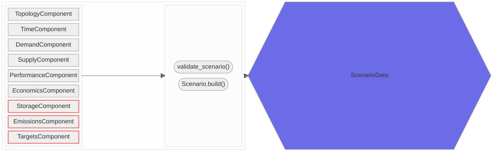

**Legend**
> names of relevant pyoscomp module(s)

```mermaid
---
config:
    theme: 'neutral'
---
block
    A["A"]
    B["B"]
    C(["C"])
    D{{"D"}}

    classDef TODO color:#f66,stroke:#f66,stroke-width:2px
    class B TODO

    classDef dataclass fill:#6e6ce6,color:#fff
    class D dataclass
```

A, B = Class Object <span style="color:red">(TODO)</span>
C = Function or Class Method
D = DataClass Object

---
### 1. Scenario Authoring
> modules: `scenario`, `interfaces`

```mermaid
---
config:
    theme: 'neutral'
---
block
    columns 2
    block:scenario
        columns 3
        block:group1
            columns 1
            T1["TopologyComponent"]
            T2["TimeComponent"]
            T3["DemandComponent"]
            T4["SupplyComponent"]
            T5["PerformanceComponent"]
            T6["EconomicsComponent"]
            T7["StorageComponent"]
            T8["EmissionsComponent"]
            T9["TargetsComponent"]
        end

        classDef TODO color:#f66,stroke:#f66,stroke-width:2px
        class T7 TODO
        class T8 TODO
        class T9 TODO

        space

        block:group2
            columns 1
            space:3
            S1(["validate_scenario()"])
            S2(["Scenario.build()"])
            space:3
        end

        group1 --> group2
    end
    scenario --> D{{"ScenarioData"}}

    classDef dataclass fill:#6e6ce6,color:#fff
    class D dataclass
```

#### Component Usage Model

Scenario components are the mutable authoring layer. Each component owns a
defined set of CSV files and should be used in dependency order.

Recommended order:

1. `TopologyComponent`
2. `TimeComponent`
3. `SupplyComponent`
4. `DemandComponent`
5. `PerformanceComponent`
6. `EconomicsComponent`

Ownership principle:

- Supply defines what technologies and fuel/mode relationships exist.
- Performance defines how those technologies operate.
- Demand defines annual volumes and profile shape.
- Time defines the temporal axis used by demand and performance.

Lifecycle pattern:

1. Instantiate component with `scenario_dir`
2. Add records using public `set_*` and `add_*` methods
3. Call `process()` where required (`DemandComponent`,
   `PerformanceComponent`)
4. Optionally call `validate()` for early checks
5. Call `save()` to write schema-validated CSVs

Short usage sketch:

```python
from pyoscomp.scenario.components import (
    TopologyComponent,
    TimeComponent,
    SupplyComponent,
    DemandComponent,
    PerformanceComponent,
    EconomicsComponent,
)

scenario_dir = "path/to/scenario"

topology = TopologyComponent(scenario_dir)
topology.add_nodes(["R1"])
topology.save()

time = TimeComponent(scenario_dir)
time.add_time_structure(
    years=[2026, 2027],
    seasons={"Winter": 90, "Summer": 90, "Shoulder": 185},
    daytypes={"Weekday": 5, "Weekend": 2},
    brackets={"Day": 16, "Night": 8},
)
time.save()

supply = SupplyComponent(scenario_dir)
supply.add_technology("R1", "GAS_CCGT") \
    .with_operational_life(30) \
    .as_conversion(input_fuel="GAS", output_fuel="ELEC")
supply.save()

demand = DemandComponent(scenario_dir)
demand.add_annual_demand("R1", "ELEC", {2026: 100, 2027: 110})
demand.process()
demand.save()

performance = PerformanceComponent(scenario_dir)
performance.set_efficiency("R1", "GAS_CCGT", 0.55)
performance.set_capacity_factor("R1", "GAS_CCGT", 0.9)
performance.process()
performance.save()

economics = EconomicsComponent(scenario_dir)
economics.set_discount_rate("R1", 0.05)
economics.set_capital_cost("R1", "GAS_CCGT", {2026: 700, 2027: 680})
economics.save()
```

Detailed component-level guidance lives in:

- `pyoscomp/scenario/components/README.md`

---
### 2. Translation to Model Input
> modules: `interfaces`, `translation`
---
### 3. Model Execution
> modules: `runners`
---
### 4. Translation of Model Output
> modules: `translation`, `interfaces`
---
### 5. Post-processing & Comparison
> 
---