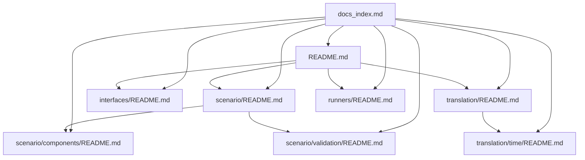

# PyOSComp Documentation Index

Central navigation hub for module documentation.

## Quick Links

- [Package Overview](README.md)
- [Scenario Module](scenario/README.md)
- [Scenario Components](scenario/components/README.md)
- [Scenario Validation](scenario/validation/README.md)
- [Interfaces Module](interfaces/README.md)
- [Translation Module](translation/README.md)
- [Time Translation Submodule](translation/time/README.md)
- [Runners Module](runners/README.md)

## Navigation Graph

## Suggested Start Paths

- New to the package: [Package Overview](README.md) -> [Scenario Module](scenario/README.md) -> [Interfaces Module](interfaces/README.md)
- Working on model translation: [Translation Module](translation/README.md) -> [Time Translation Submodule](translation/time/README.md) -> [Runners Module](runners/README.md)
- Working on scenario authoring: [Scenario Components](scenario/components/README.md) -> [Scenario Validation](scenario/validation/README.md)
