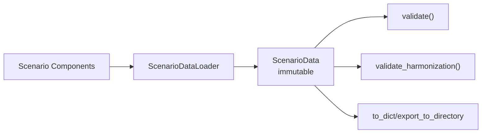
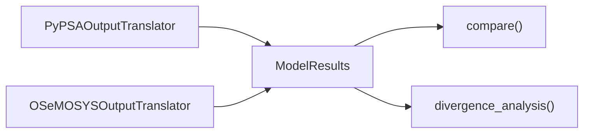

# Interfaces Module

The `interfaces` package is the immutable contract layer between mutable scenario
authoring and model-specific translators/runners.

## Related READMEs

- [Package Overview](../README.md)
- [Scenario Module](../scenario/README.md)
- [Scenario Components](../scenario/components/README.md)
- [Scenario Validation](../scenario/validation/README.md)
- [Translation Module](../translation/README.md)
- [Time Translation Submodule](../translation/time/README.md)
- [Runners Module](../runners/README.md)

## Core Objects

| Object | Purpose |
|---|---|
| `OSeMOSYSSets` | Typed immutable set universe (`regions`, `years`, `technologies`, ...) |
| `TimeParameters` ... `StorageParameters` | Grouped DataFrame contracts by domain |
| `ScenarioData` | Aggregate input interface used by translators |
| `ModelResults` (+ sub-results) | Aggregate output interface used for comparison |
| Harmonization utilities | Input/translation parity checks and NPV comparisons |

## Input-Side Data Contract



## Output-Side Data Contract



## Typical Usage

```python
from pyoscomp.interfaces import ScenarioData

data = ScenarioData.from_directory("path/to/scenario", validate=True)
data.validate(strict_protocol=False)

report = data.validate_harmonization()
print(report.passed)

capital_cost = data.get_parameter("CapitalCost")
print(capital_cost.head())
```

## Strict Protocol Mode

`ScenarioData.validate(strict_protocol=True)` runs harmonization checks and fails
if required metrics do not pass. This is useful for CI gates where you want
explicitly harmonized scenarios before model runs.

## Edge Cases

- Missing optional data tables are represented as empty DataFrames.
- Required set emptiness (`regions`, `years`, `technologies`, `timeslices`) fails
	validation.
- Storage parameters are optional, but if provided they must reference declared
	sets.

## Suggested Improvements

- Add richer machine-readable validation reports from `ScenarioData.validate`.
- Tighten optional/required policy for economics fields depending on run mode.
- Extend strict protocol with configurable metric subsets by experiment type.
