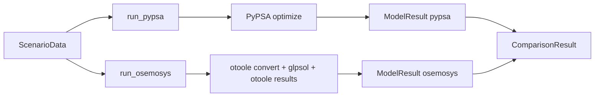

# Runners Module

The runners layer executes translated models and exposes harmonized result
containers.

## Related READMEs

- [Package Overview](../README.md)
- [Scenario Module](../scenario/README.md)
- [Scenario Components](../scenario/components/README.md)
- [Scenario Validation](../scenario/validation/README.md)
- [Interfaces Module](../interfaces/README.md)
- [Translation Module](../translation/README.md)
- [Time Translation Submodule](../translation/time/README.md)

## Main Runner Classes

| Runner | Purpose | Input | Output |
|---|---|---|---|
| `PyPSARunner` | Build + optimize PyPSA network | `ScenarioData` | solved `pypsa.Network` + `ModelResults` |
| `OSeMOSYSRunner` | Execute OSeMOSYS via otoole/glpsol pipeline | scenario directory or `ScenarioData` | OSeMOSYS results directory |

## Unified Orchestration

The higher-level entrypoint lives in `pyoscomp.run`:

- `run_pypsa(...)`
- `run_osemosys(...)`
- `run(..., model='pypsa'|'osemosys'|'both')`

These also attach harmonization diagnostics (input checks, translation checks,
and cross-model NPV parity when both runs are available).

## Execution Flow



## Minimal Usage

```python
from pyoscomp.interfaces import ScenarioData
from pyoscomp.run import run

data = ScenarioData.from_directory("path/to/scenario")

comparison = run(
		data,
		model="both",
		pypsa_options={"solver_name": "highs"},
)

print(comparison.pypsa.status)
print(comparison.osemosys.status)
print(comparison.compare_objectives())
```

## External Dependencies

- PyPSA path: solver backend (for example `highs` or `glpk`).
- OSeMOSYS path: `otoole` and `glpsol` binaries available on system `PATH`.

## Edge Cases

- OSeMOSYS runner currently has a Pyomo branch placeholder (`NotImplementedError`
	when `use_otoole=False`).
- Missing external binaries fail at subprocess execution time.
- Infeasible runs can still produce partial artifacts; downstream error handling
	should check status and file completeness.

## Suggested Improvements

- Add explicit pre-flight binary checks with actionable error messages.
- Add standardized timeout and retry behavior.
- Harmonize status/error reporting shape across both runner classes and `run.py`.
