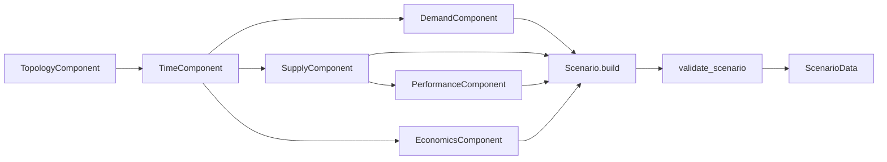

# Scenario Module

The `scenario` package is the mutable authoring layer of PyOSComp. It produces
OSeMOSYS-style CSV inputs in a controlled order so they can be validated,
translated, and executed consistently.

## Related READMEs

- [Documentation Index](../docs_index.md)
- [Package Overview](../README.md)
- [Scenario Components](components/README.md)
- [Scenario Validation](validation/README.md)
- [Interfaces Module](../interfaces/README.md)
- [Translation Module](../translation/README.md)
- [Time Translation Submodule](../translation/time/README.md)
- [Runners Module](../runners/README.md)

## Scope

- Build scenario inputs from Python APIs.
- Persist schema-aligned CSV files.
- Validate cross-component references before translation.

## Main API

- `Scenario` in `core.py`: orchestrates component lifecycle.
- `ScenarioManager` in `manager.py`: scaffolds scenario directories and can create
	placeholder CSV files from configuration.
- `validation.validate_scenario`: cross-file reference checks.

## Build Flow



## Recommended Authoring Order

1. `TopologyComponent`
2. `TimeComponent`
3. `SupplyComponent`
4. `DemandComponent`
5. `PerformanceComponent`
6. `EconomicsComponent`
7. `StorageComponent` (if used)

This order matches real prerequisites in component constructors and processing
logic.

## Example

```python
from pyoscomp.scenario.components import (
		TopologyComponent,
		TimeComponent,
		SupplyComponent,
		DemandComponent,
		PerformanceComponent,
		EconomicsComponent,
)
from pyoscomp.interfaces import ScenarioData
from pyoscomp.scenario.validation.cross_reference import validate_scenario

scenario_dir = "path/to/scenario"

topology = TopologyComponent(scenario_dir)
topology.add_nodes(["R1"])
topology.save()

time = TimeComponent(scenario_dir)
time.add_time_structure(
		years=[2025],
		seasons={"WINTER": 120, "SUMMER": 245},
		daytypes={"WEEKDAY": 5, "WEEKEND": 2},
		brackets={"DAY": 16, "NIGHT": 8},
)
time.save()

supply = SupplyComponent(scenario_dir)
supply.add_technology("R1", "GAS_CCGT").with_operational_life(30).as_conversion(
		input_fuel="GAS", output_fuel="ELEC"
)
supply.save()

demand = DemandComponent(scenario_dir)
demand.add_annual_demand("R1", "ELEC", {2025: 100.0})
# Assign a custom demand profile over timeslices.
demand.set_profile(
		"R1",
		"ELEC",
		year=2025,
		timeslice_weights={
				"WINTER_WEEKDAY_DAY": 0.26,
				"WINTER_WEEKDAY_NIGHT": 0.14,
				"WINTER_WEEKEND_DAY": 0.09,
				"WINTER_WEEKEND_NIGHT": 0.06,
				"SUMMER_WEEKDAY_DAY": 0.22,
				"SUMMER_WEEKDAY_NIGHT": 0.10,
				"SUMMER_WEEKEND_DAY": 0.08,
				"SUMMER_WEEKEND_NIGHT": 0.05,
		},
)
demand.process()
demand.save()

performance = PerformanceComponent(scenario_dir)
performance.set_efficiency("R1", "GAS_CCGT", 0.5)
performance.set_capacity_factor(
		"R1",
		"GAS_CCGT",
		factor=0.85,
		timeslice_weights={
				"WINTER_WEEKDAY_DAY": 1.00,
				"WINTER_WEEKDAY_NIGHT": 0.95,
				"WINTER_WEEKEND_DAY": 0.98,
				"WINTER_WEEKEND_NIGHT": 0.95,
				"SUMMER_WEEKDAY_DAY": 0.90,
				"SUMMER_WEEKDAY_NIGHT": 0.88,
				"SUMMER_WEEKEND_DAY": 0.89,
				"SUMMER_WEEKEND_NIGHT": 0.87,
		},
)
performance.set_availability_factor("R1", "GAS_CCGT", {2025: 0.93})
performance.process()
performance.save()

economics = EconomicsComponent(scenario_dir)
economics.set_discount_rate("R1", 0.05)
economics.set_capital_cost("R1", "GAS_CCGT", {2025: 500.0})
economics.set_variable_cost("R1", "GAS_CCGT", "MODE1", {2025: 2.0})
economics.save()

# Validation at scenario CSV level.
validate_scenario(scenario_dir)

data = ScenarioData.from_directory(scenario_dir)
```

Why `process()` matters:

- `DemandComponent.process()` materializes and normalizes `SpecifiedDemandProfile`.
- `PerformanceComponent.process()` expands weighted assignments into full
	`CapacityFactor` and fills defaults for missing factors.

## Validation and Visualization Workflow

After authoring and saving components, the typical user workflow is:

1. Validate schema and cross-file references (`validate_scenario`).
2. Load immutable interfaces (`ScenarioData.from_directory`).
3. Run harmonization checks (`ScenarioData.validate_harmonization`).
4. Visualize translation and profile consistency (`HarmonizationVisualizer`).

```python
from pyoscomp.interfaces import ScenarioData
from pyoscomp.translation import PyPSAInputTranslator
from pyoscomp.visualization import HarmonizationVisualizer
from pyoscomp.scenario.validation.cross_reference import validate_scenario

scenario_dir = "path/to/scenario"

# 1) Validate raw scenario files.
validate_scenario(scenario_dir)

# 2) Load immutable interface.
data = ScenarioData.from_directory(scenario_dir, validate=True)

# 3) Harmonization report.
report = data.validate_harmonization()
print("Input harmonization passed:", report.passed)

# 4) Build PyPSA network and inspect translation quality.
network = PyPSAInputTranslator(data).translate()
viz = HarmonizationVisualizer()

fig_time = viz.plot_time_structure(data, network)
fig_demand = viz.plot_demand_profile(data, network)
fig_cf = viz.plot_capacity_factor_profile(data, network, technology="GAS_CCGT")
fig_report = viz.plot_translation_report(data, network)
```

For deeper details on checks and plots, see:

- [Scenario Validation](validation/README.md)
- [Interfaces Module](../interfaces/README.md)
- [Package Overview](../README.md)

## `Scenario` Orchestration Notes

`Scenario.build()` currently:

- Loads all component CSVs.
- Processes demand and performance.
- Saves all components.
- Runs cross-reference validation.
- Optionally returns `ScenarioData`.

Because it calls `load()`, it assumes files already exist or were scaffolded.
For blank directories, use `ScenarioManager.create_scenario()` first or run the
manual component flow.

## Common Edge Cases

- Instantiating `DemandComponent`/`SupplyComponent`/`PerformanceComponent` before
	topology/time files exist raises prerequisite errors.
- Calling `PerformanceComponent` before supply has been saved can leave technology
	and fuel maps unresolved.
- Missing `process()` call in demand/performance can leave downstream profiles
	incomplete or stale.

## Improvements To Consider

- Add a first-class `Scenario.initialize()` helper for fresh directories.
- Extend `Scenario.build()` with explicit mode flags (`load_only`,
	`process_only`, `save_only`, `validate_only`).
- Add richer scenario summaries (counts, coverage checks, and warnings) before
	translation.
