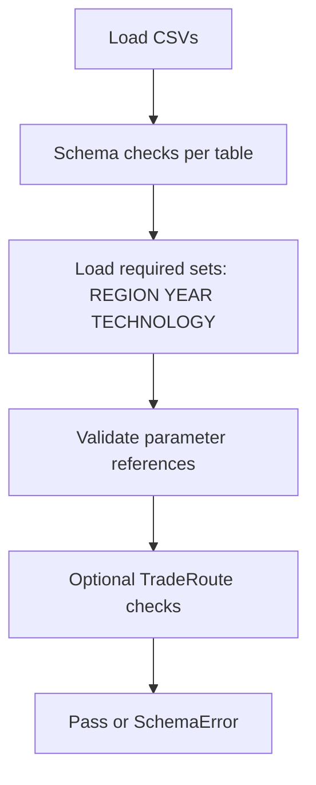

# Scenario Validation Module

This module validates scenario CSV integrity in two layers:

## Related READMEs

- [Package Overview](../../README.md)
- [Scenario Module](../README.md)
- [Scenario Components](../components/README.md)
- [Interfaces Module](../../interfaces/README.md)
- [Translation Module](../../translation/README.md)
- [Time Translation Submodule](../../translation/time/README.md)
- [Runners Module](../../runners/README.md)

1. Schema checks (`schemas.py`) for column presence, dtype compatibility,
	 duplicate-key safety, and null checks.
2. Cross-reference checks (`cross_reference.py`) for set membership across files
	 (for example, `TECHNOLOGY` usage in parameter files must exist in
	 `TECHNOLOGY.csv`).

## Main APIs

- `SchemaRegistry`: loads schema definitions from `OSeMOSYS_config.yaml`.
- `validate_csv(name, df, schema)`: validates one DataFrame against schema.
- `validate_column_reference(...)`: validates single-column foreign-key style
	references.
- `validate_scenario(scenario_dir)`: validates cross-file consistency for a
	scenario directory.

## Validation Flow



## Minimal Usage

```python
from pyoscomp.scenario.validation.cross_reference import validate_scenario

validate_scenario("path/to/scenario")
print("Cross-reference validation passed")
```

## What It Catches Well

- Missing required set files for cross-reference stage.
- Missing columns and unexpected columns.
- Duplicate index rows in parameter-like tables.
- Unknown set references in major time, demand, supply, performance, and cost
	tables.

## Current Edge Cases / Limits

- Some deeper physical constraints are not enforced here (for example,
	`YearSplit` and demand profile sum constraints are primarily validated in
	component/interfaces logic).
- Cross-reference logic currently includes a static map of parameter files and
	columns; newly added files require manual updates.
- Trade validation is basic and depends on detected column names.

## Suggested Improvements

- Add explicit numeric invariants in this layer (for example, strict yearly
	sums for selected normalized parameters).
- Add schema-driven auto-discovery of cross-reference fields instead of static
	hardcoded mapping.
- Add severity levels (`error`, `warning`) and report objects for better CI and
	notebook UX.
