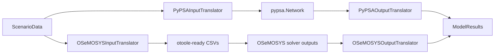

# Translation Module

The translation layer converts immutable `ScenarioData` into model-specific input
formats and converts model outputs back into harmonized `ModelResults`.

## Related READMEs

- [Package Overview](../README.md)
- [Scenario Module](../scenario/README.md)
- [Scenario Components](../scenario/components/README.md)
- [Scenario Validation](../scenario/validation/README.md)
- [Interfaces Module](../interfaces/README.md)
- [Time Translation Submodule](time/README.md)
- [Runners Module](../runners/README.md)

## Input Translators

| Translator | Input | Output |
|---|---|---|
| `PyPSAInputTranslator` | `ScenarioData` | `pypsa.Network` |
| `OSeMOSYSInputTranslator` | `ScenarioData` | Dict of OSeMOSYS tables or CSV export |

## Output Translators

| Translator | Input | Output |
|---|---|---|
| `PyPSAOutputTranslator` | solved `pypsa.Network` | `ModelResults` |
| `OSeMOSYSOutputTranslator` | otoole results folder/dict | `ModelResults` |

## Pipeline



## Key Mapping Notes

| OSeMOSYS concept | PyPSA concept | Current behavior |
|---|---|---|
| `REGION` | `Bus` | one bus per region |
| `FUEL` | `Carrier` | fuel set mapped to carriers |
| `CapacityFactor * AvailabilityFactor` | `generators_t.p_max_pu` | multiplicative mapping per snapshot |
| `ResidualCapacity` | `p_nom` | initial existing capacity |
| `CapitalCost` + `FixedCost` | `capital_cost` | annualized CAPEX + fixed O&M |
| `VariableCost` | `marginal_cost` | mapped directly |
| Storage triplet | `StorageUnit` | merged representation with assumptions |

## Minimal Usage

```python
from pyoscomp.interfaces import ScenarioData
from pyoscomp.translation import PyPSAInputTranslator, OSeMOSYSInputTranslator

data = ScenarioData.from_directory("path/to/scenario")

network = PyPSAInputTranslator(data).translate()

osemosys = OSeMOSYSInputTranslator(data)
tables = osemosys.translate()
osemosys.export_to_csv("path/to/osemosys_input")
```

## Edge Cases

- Multi-year translation relies on valid year/timeslice construction and snapshot
	weighting consistency.
- Missing profile/cost fields trigger defaults, but these defaults can mask poor
	input completeness if not checked.
- Storage translation merges separate OSeMOSYS entities into one PyPSA storage
	object, which preserves core economics but can collapse attribution detail.

## Suggested Improvements

- Add explicit translation report objects capturing each assumption/default used.
- Strengthen multi-region trade mapping between OSeMOSYS trade and PyPSA links.
- Add round-trip sanity tooling (`ScenarioData` -> model input ->
	reconstructed interface snapshots).
