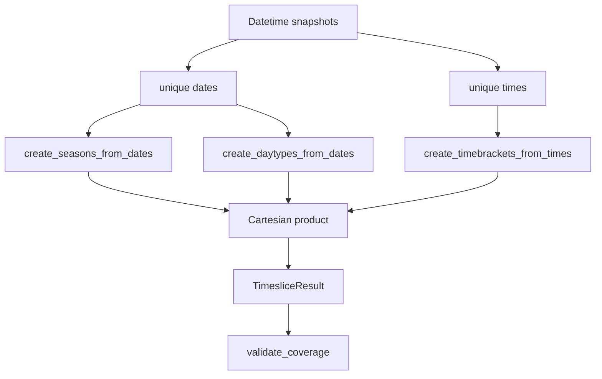
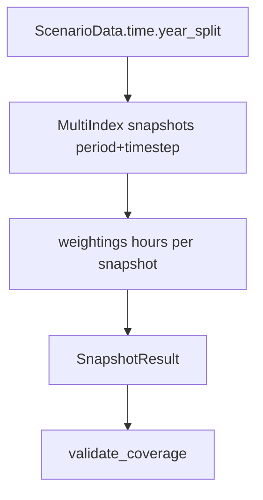

# Time Translation Submodule

This submodule converts between two different temporal representations:

- PyPSA snapshots (sequential timestamps with weights)
- OSeMOSYS timeslices (Season × DayType × DailyTimeBracket)

## Related READMEs

- [Package Overview](../../README.md)
- [Scenario Module](../../scenario/README.md)
- [Scenario Components](../../scenario/components/README.md)
- [Scenario Validation](../../scenario/validation/README.md)
- [Interfaces Module](../../interfaces/README.md)
- [Translation Module](../README.md)
- [Runners Module](../../runners/README.md)

## Why This Exists

PyPSA and OSeMOSYS reason about time differently. This module creates a
consistent bridge so the same scenario can be evaluated in both frameworks.

Core implementations:

- [translate.py](translate.py): `to_timeslices`, `to_snapshots`
- [helpers.py](helpers.py): structure construction helpers
- [structures.py](structures.py): `Season`, `DayType`, `DailyTimeBracket`, `Timeslice`
- [mapping.py](mapping.py): snapshot-to-timeslice mapping logic
- [results.py](results.py): `TimesliceResult`, `SnapshotResult`

Validation is backed by passing tests in [tests/test_translation/test_time](../../../tests/test_translation/test_time).

## Main APIs

- `to_timeslices(snapshots)` -> `TimesliceResult`
- `to_snapshots(scenario_data)` -> `SnapshotResult`
- Mapping helpers: `create_map`, `create_endpoints`
- Structure classes: `Season`, `DayType`, `DailyTimeBracket`, `Timeslice`

## Conversion Direction 1: Snapshots -> Timeslices



Detailed algorithm (`to_timeslices`):

1. Input normalization:
	- Converts input to `pd.DatetimeIndex`
	- Sorts snapshots
	- Raises if empty or non-datetime-like
2. Year extraction:
	- `years = sorted(unique(snapshot.year))`
3. Date decomposition:
	- `create_seasons_from_dates(unique_dates)`
	- `create_daytypes_from_dates(unique_dates)`
4. Time decomposition:
	- `create_timebrackets_from_times(unique_times)`
5. Cartesian construction:
	- Build all `Timeslice(season, daytype, dailytimebracket)` combinations
6. Coverage validation:
	- For each year: `sum(ts.duration_hours(year)) == hours_in_year(year)`
	- Enforced via `TimesliceResult.validate_coverage()`

Helper behavior that matters:

- `create_seasons_from_dates`:
  - Builds month ranges from observed months
  - Fills month gaps to cover January to December
- `create_daytypes_from_dates`:
  - Builds day ranges from observed day-of-month values
  - Fills gaps and enforces max 7-day `DayType` spans
- `create_timebrackets_from_times`:
  - Ensures midnight start (inserts `00:00` if missing)
  - Produces contiguous brackets ending at `ENDOFDAY`

Important consequence:

- The resulting timeslice set is a complete partition of each model year, even
  if the original snapshots were sparse or irregular.

## Conversion Direction 2: Timeslices -> Snapshots



Detailed algorithm (`to_snapshots`):

1. Reads from `ScenarioData`:
	- `sets.years`
	- `sets.timeslices`
	- `time.year_split`
2. Creates PyPSA snapshot index:
	- `pd.MultiIndex.from_product([years, timeslice_names], names=['period', 'timestep'])`
3. Converts `YearSplit` to hour weights:
	- `hours = fraction * hours_in_year(year)`
4. Reindexes weights to full snapshot MultiIndex
5. Validates annual coverage:
	- Sum of weights for each `period` equals `8760` or `8784`

Notes:

- `to_snapshots` expects `ScenarioData`.
- Snapshot labels are categorical `(period, timestep)` pairs, not absolute
  datetimes.

## Mapping Semantics: `create_map`

`create_map` links each PyPSA snapshot to `(year, timeslice)` pairs.

Period semantics:

- Snapshot `i` is valid on `[t_i, t_{i+1})`
- Last snapshot is valid until Dec 31 `ENDOFDAY` of its year

Assignment strategy:

1. Compute canonical start for each timeslice/year via `_get_canonical_start`:
	- earliest valid month/day/time for that timeslice pattern
2. Assign timeslice to the snapshot period containing canonical start
3. Validate mapped duration equals period duration (1-second tolerance)

Endpoint behavior (`create_endpoints`):

- Adds Jan 1 and Dec 31 `ENDOFDAY` boundaries for years that appear in snapshots
- Keeps list sorted and deduplicated
- Does not invent intermediate years with no snapshots

This behavior is directly tested in [test_endpoints.py](../../../tests/test_translation/test_time/test_endpoints.py) and [test_mapping.py](../../../tests/test_translation/test_time/test_mapping.py).

## Invariants Enforced

Validated by implementation and tests:

1. Coverage:
	- Timeslices sum to full annual hours per year
2. Mapping consistency:
	- Mapped timeslice hours match each snapshot period duration
3. No duplicates:
	- No duplicate `(year, timeslice)` pairs for a snapshot
4. Completeness:
	- Every snapshot maps to at least one timeslice

Reference tests:

- [test_validation.py](../../../tests/test_translation/test_time/test_validation.py)
- [test_mapping.py](../../../tests/test_translation/test_time/test_mapping.py)
- [test_to_timeslices.py](../../../tests/test_translation/test_time/test_to_timeslices.py)
- [test_to_snapshots.py](../../../tests/test_translation/test_time/test_to_snapshots.py)

## Minimal Usage

```python
import pandas as pd
from pyoscomp.translation.time import to_timeslices, to_snapshots
from pyoscomp.interfaces import ScenarioData
from pyoscomp.translation.time import create_map

snapshots = pd.date_range("2025-01-01", periods=24, freq="h")
timeslice_result = to_timeslices(snapshots)
assert timeslice_result.validate_coverage()

# Optional: map each snapshot to (year, timeslice) pairs
mapping = create_map(snapshots, timeslice_result.timeslices)

data = ScenarioData.from_directory("path/to/scenario")
snapshot_result = to_snapshots(data)
assert snapshot_result.validate_coverage()

# Apply to a PyPSA network
# snapshot_result.apply_to_network(network)
```

## Practical Interpretation

- `to_timeslices` is "structure inference" from timestamp patterns.
- `to_snapshots` is "weight reconstruction" from OSeMOSYS `YearSplit`.
- `create_map` is the bridge used when associating snapshot-valid data windows
  with OSeMOSYS timeslice combinations.

## Edge Cases

- Leap-year coverage (`8784` h) is explicitly handled.
- Feb 29 daytypes have zero duration in non-leap years.
- Day 31 daytypes have zero duration in shorter months.
- Invalid or sparse snapshot patterns may create many low-utility timeslices,
	though coverage still validates by design.
- `create_map` enforces duration consistency between snapshot validity windows and
	mapped timeslices.
- Snapshots crossing year boundaries can map to two years in one period.

## Suggested Improvements

- Add optional timeslice pruning heuristics for near-zero or unused timeslices.
- Add explicit diagnostics for temporal granularity loss in each conversion
	direction.
- Add benchmark utilities for large multi-year/hourly conversion performance.
